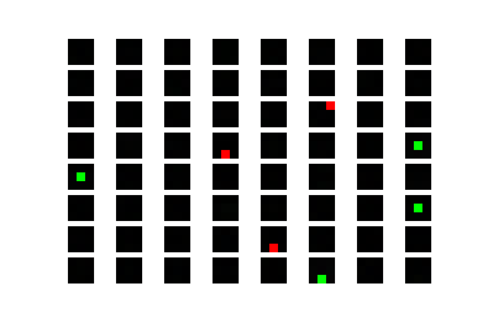
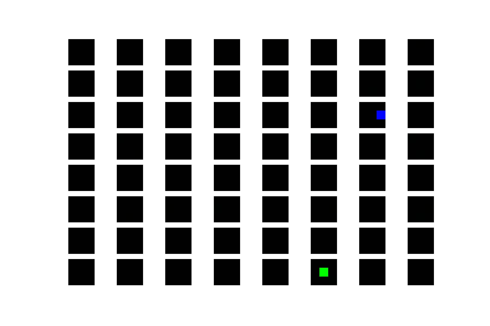
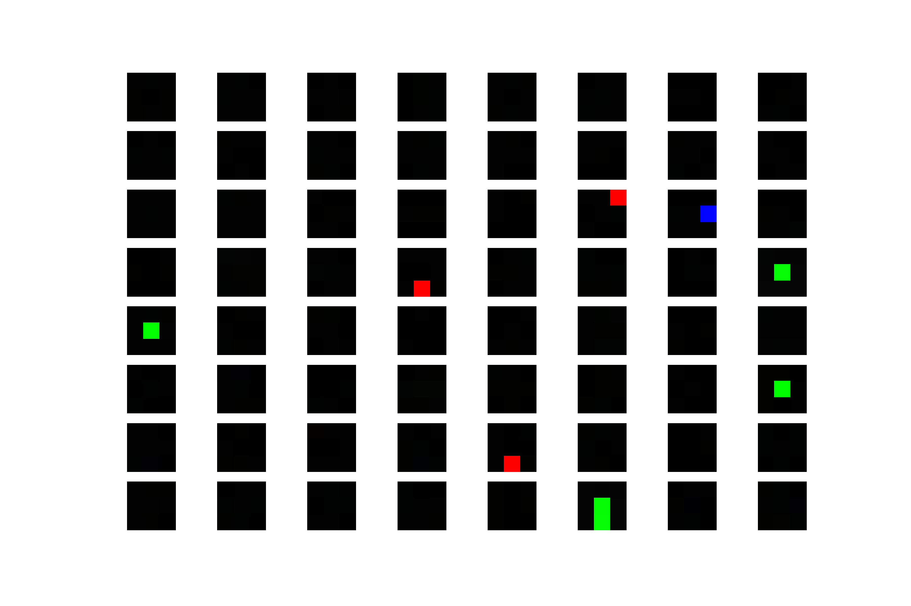

<!--- Draft options -->
\SetWatermarkScale{0.3}
\SetWatermarkText{\textbf{Draft: \today}}

<!--- Macros -->
<##define note|\coloredtext{red}{NOTE: #1}\newline>
<##define check|\coloredtext{blue}{CHECK: #1}\newline>
<##define todo|\coloredtext{green}{TODO: #1}\newline>

# Introduction {#sec:introduction}

Action Recognition in Computer Vision refers to approaches that aim to infer the
action or actions of an actor or actors using visual observations, in the form
of images or videos. In this thesis we further constrain the: definition to only
infer actions from video sequences (sequences of images captured by video
cameras at regular intervals). Action recognition from video has many critical
applications[@ranasinghe2016_reviewapplicationsactivity] such as detecting
suspicious behaviours of travellers in airports from CCTV footage, recognising
the fall of an elderly person who lives alone, and ensuring the safety of the
operator of a machine by automatically stopping the machine in case of an
accident.

Convolutional Neural Networks (CNNs), a form of supervised deep learning model,
have recently been used to obtain state of the art results in object detection
in images[@krizhevsky2012_Imagenetclassificationdeep]. Naturally researchers
have questioned whether these performance increases translate to action
recognition. The results of extending CNN architectures to cope with video
sequences have yielded similar increases in performance
[@feichtenhofer2016_ConvolutionalTwoStreamNetwork;@wang2016_TemporalSegmentNetworks]

One downside of CNNs compared to other models such as decision trees is their
lack of transparency in predictions: why does the model classify this particular
video sequence of a person performing pull ups as skipping? With a decision tree
we would be able to provide an explanation based on the features from the root
of the tree to the branch, but there's no obvious analogous technique to
understand a CNN's prediction.

There are efforts made to develop techniques to help understand the
features learnt by CNNs to aid debugging, but most of these have been developed
and tested on object detection networks; there is little research to see
whether the techniques generalise to networks trained for other tasks such as
action recognition.

This thesis investigates the applicability of visualisation techniques for two
stream CNNs (2SCNN)[@simonyan2014_TwoStreamConvolutionalNetworks] trained for
action recognition^[There are other architectures for action recognition, but
they are out of the scope of this investigation]. A method called Excitation
Backpropagation (EBP)[@zhang2016_TopdownNeuralAttention] is used and extended to
produce attention maps (heatmaps indicating the regions of importance in
activating a given neuron in the network) across sequences of frames from a
video sequence classified by a 2SCNN.

# Background {#sec:background}

We introduce the basic concepts of artificial neural networks and convolutional
neural networks, then we go on to look at visualisation techniques developed to
understand the different aspects of trained CNNs with a particular focus on
excitation back propagation which is studied at depth in [@sec:ebp-for-2scnn]
and extended for the application to two stream CNNs.

## Artificial neural networks (ANNs) {#sec:background:ann}

Biology is a rich source of inspiration for techniques in computer science.
Artificial neural networks (ANNs) form a strand of biologically inspired
computational models based on the learning and communication processes in the
brain. To understand neural networks, we will examine each concept from the
bottom up step by step until we arrive at the modern model of an artificial
neural network. First we shall examine *artificial neurons*, of which there are
several models, the earliest being the McCulloch-Pitts
neuron[@mcculloch1943_logicalcalculusideas], followed by the
perceptron[@rosenblatt1957_Perceptronperceivingrecognising]. We will then
demonstrate how one can form a network made up of artificial neurons using
perceptrons, then briefly discuss the computational challenges scaling these
networks up to process images or videos leading into an introduction to
convolutional neural networks, a constrained form ANN architecture encoding
certain assumptions about the input to make training these models on modern
computers a computationally tractable proposition.

### The McCulloch-Pitt's neuron

The McCulloch-Pitt's neuron is mostly a historical curiosity, and if the
evolution of artificial neural networks doesn't interest you skip ahead to the
perceptron.

Warren McCulloch and Walter Pitts were arguably the first to provide a
mathematical model of neuron inspired by biology, they developed a logical
calculus describing neuron behaviour[@mcculloch1943_logicalcalculusideas]. Their
model neuron, known as McCulloch-Pitt's neuron (MCP), was shown to be
computationally universal; every network of MCP neurons encoded an equivalent
logical proposition.

MCP neurons have a set of inputs, the sum of which is compared to a threshold
which determines whether the neuron fires or not. Both excitatory and inhibitory
signals were modelled, if an incoming inhibitory connection is firing, then the
output is completely inhibited regardless of the firing of the other incoming
signals. Cells produce a binary output, they either fire or not, there is no
notion of firing strength.

### The Perceptron

The next major contribution to the realisation of ANNs following McCulloch and
Pitt's work was the Perceptron[@rosenblatt1957_Perceptronperceivingrecognising]
developed by Frank Rosenblatt, initially conceived as a physical device for
learning to recognise patterns in images or sounds (each of these using the same
principles, but with different inputs), it was later
formulated as an algorithm for implementation in software.

The perceptron, in modern machine learning terms, is a supervised learning
algorithm that produces a binary linear classifier. First we'll step through
each term in this definition before presenting the perceptron:

* *learning* is concerned with the problem of constructing a function $f : X
  \rightarrow Y$, where $X$ denotes the feature space, $Y$ denotes the label space.
* *feature space*, the vector space of data we want to predict a class from
  (domain of $f$). The data available to be used as input to the model
  influences the choice of domain, e.g. an image of size $W \times H$ could be
  analysed for edges and those used as the feature vector, or every pixel could
  be used in $W \times H$ long vector as input to the predictive function,
  amongst many other possibilities.
* *label space*, the vector space in which the desired result resides (co-domain
  of $f$).
* *supervised learning* uses a labelled training set $X_{\text{train}} =
  \{ (\bm{x}_0, y_0), \ldots, (\bm{x}_n, y_n) \}$ to learn $f$ where
  $X_{\text{train}}$ is used as a set of examples by the learning algorithm used
  to construct $f$.
* *classification* further refines the definition of the function $f$ to be
  learnt. Classification is about learning a function that predicts one of a
  finite number of labels hence the label space will be a finite set of
  labels/classes.
* *binary classification* specifies that the *label space* consists of a set of
  2 labels/classes, usually referred to as the *positive* and *negative* classes.
* a *linear classifier* implies that the learnt model is of the form $\bm{w}
  \cdot \bm{x} > 0$ where $\bm{w}$ is a vector of weights and $\bm{x}$ is the
  instance in feature space to be classified. The classifier predicts the
  positive class if $\bm{w} \cdot \bm{x} > 0$, and the negative class if $\bm{w}
  \cdot \bm{x} < 0$, if $\bm{w} \cdot \bm{x} = 0$ the instance lies on the
  decision boundary and we have to make a decision as to which class to predict
  (e.g. randomly choose positive class 50% of the time)

A graphical representation of the perceptron is given in [@fig:perceptron], each
element $x_i$ of the feature vector forms an input node on a graph, elements of
the weight vector $w_i$ form edges from the corresponding input ($x_i$) to the
perceptron body which computes the weighted sum of all the inputs. One can think
of inputs flowing along the edges into the perceptron body, as they flow along
the edge they are multiplied by the edge's weight, finally the perceptron body
sums its inputs producing the perceptron output $z = \bm{w} \cdot \bm{x}$.

{#fig:perceptron}

The perceptron learning algorithm constructs $\bm{w}$ from a set
of labelled training examples ${\mathscr{X} = \{ (\bm{x}_0, y_0), \ldots,
(\bm{x}_n, y_n) \}}$ where $\bm{x}_i$ is the feature representation of the $i$-th
training example, and $y_i$ is the true label of the example (a numerical
encoding of its class, typically 1 represents the positive class, and -1 the
negative class).

Algorithm \ref{alg:perceptron-training} learns a $\bm{w}$ such that the
resulting linear classifier correctly classifies all examples on the training set (if
possible, otherwise the algorithm fails to terminate).

\begin{algorithm}[H]
\label{alg:perceptron-training}
\caption{Perceptron training}
\SetKwData{Converged}{converged}
\KwData{Training set: $\mathscr{X} = \{(\bm{x_0}, y_0), \cdots, (\bm{x_n}, y_n)\}$}
\KwResult{Binary classifier: $\bm{w} \cdot \bm{x} > 0$}
$\bm{w} \leftarrow \bm{0}$\;
\Converged $\leftarrow$ false\;
\While{\Converged = false}{
  \Converged $\leftarrow$ true\;
  \For{$i = 1$ to $|\mathscr{X}|$}{
    \If{$y_i \bm{w} \cdot \bm{x_i} \leq 0$}{
    $\bm{w} \leftarrow \bm{w} + \learningrate y_i \bm{x_i}$\;
    \Converged $\leftarrow$ false\;
    }
  }
}
\end{algorithm}

The idea is to iteratively build up a weight vector $\bm{w}$ that correctly
classifies all training data. Initially starting with the zero vector will
result in the misclassification of all training examples as they will all lie on
the decision boundary, $\bm{w} \cdot \bm{x} = 0$. The core of the algorithm
depends on interpreting the dot product as a measure of similarity: the dot
product produces a more positive result if $\bm{w}$ and $\bm{x}$ are similar,
and a negative result if $\bm{w}$ and $\bm{x}$ are
dissimilar[^dot-product-similarity] . By adding weighted training feature
vectors and factoring in the correct sign of $y_i$, $\eta \bm{x}_i y_i$ to the
weight vector $\bm{w}$, we increase the similarity of the new weight vector with
the training example resulting in a more positive dot product between $\bm{w}$
and $\bm{x}_i y_i$ which is more likely to pass the decision threshold.

[^dot-product-similarity]: Consider the definition of the dot product: ${\bm{a}
\cdot \bm{b} = |\bm{a}||\bm{b}| \cos(\theta)}$, when $\bm{a}$ and $\bm{b}$ are
orthogonal, $\theta = 90^\circ$ hence $\bm{a}
\cdot \bm{b} = 0$, when the vectors point in the same direction $\theta =
0^\circ$ then ${\bm{a} \cdot \bm{b} = |\bm{a}||\bm{b}|}$. Finally, when the
vectors point in the opposite direction $\theta = 180^\circ$ hence ${\bm{a}
\cdot \bm{b} = -|\bm{a}||\bm{b}|}$

The perceptron learns a linear classifier, which is only of use if the data is
linearly separable, if it isn't then we have to consider alternatives. Minsky
and Papert used the following example ([@fig:xor]) in
Perceptrons[@minsky1969_Perceptrons] to demonstrate the limitations of a single
perceptron, the figure shows the function XOR where the red points (negative
examples) cannot be separated from the green points (positive examples) with a
linear boundary, so a boundary like that shown in
[@fig:xor-non-linear-decision-boundary] is needed to separate the data.

{#fig:xor}

{#fig:xor-non-linear-decision-boundary}

To solve the XOR problem we can construct individual perceptrons that simulate
Boolean functions and then use the XOR propositional decomposition ($p \oplus q
= (p \lor q) \land \lnot (p \land q)$) to construct a network that implements
XOR, but this solution negates the main benefit of using a learning algorithm in
the first place: we want the machine to form a solution.

Perceptrons are capable of learning non linear decision boundaries with one of
two modifications. The first technique is to replace the dot product with a
*kernel*, a function with properties similar to that of the dot product. Use of
a kernel as a replacement for the dot product can be thought of as a
transformation of the instances into a new space in which a linear decision
boundary is learnt. A kernel is chosen such that it is likely that the data will
be linearly separable in this new space. Alternatively, the other technique is
to stack perceptrons so that the output of one is used as (one of) the input(s)
to another, the network formed is called a *multilayer perceptron (MLP)*.

When using MLPs we have to adapt the perceptron's output to be followed by a
non-linear transformation $\phi$; the reason for this is that if we otherwise
stack perceptrons without modification the network would compute a combination
of linear transformations and any combination of linear transformations can be
represented by a single linear transformation[^perceptron-affine-transform] i.e.
MLPs without non linearity applied to the output of each unit are no more
expressive than a single perceptron; the complexity of the decision boundaries
learnt by MLPs is due to the successive application of linear transformations
and non linearities.

[^perceptron-affine-transform]: A perceptron unit computes an affine transform.
    Affine transforms can be combined into a new affine transform representing
    the transform computed by combining the constituent transforms.

A small multilayer perceptron network is given in [@fig:ann-example]. Each
circle represents the body of a perceptron in which the weighted sum of its
inputs are calculated and then passed through an activation function $\phi$.
Perceptrons are labelled using the notation $\neuron{l}{j}$ where $l$ indicates
the index of the layer the perceptron lies within, and $j$ the index of the
perceptron within the layer, e.g. $\neuron{1}{0}$ is the first (index 0)
perceptron in layer 2 (index 1). Each edge between perceptrons indicates the
connectivity and weight between them. For example, $\neuron{1}{0}$ has two
incoming connections: one from $\neuron{0}{0}$ with a weight $+1$ and another
from $\neuron{0}{1}$ with a weight $0$, it will output the value ${\phi\left(1
\cdot \neuron{0}{0} + 0 \cdot \neuron{0}{1}\right)}$

{#fig:ann-example}

A forward pass of the network in [@fig:ann-example] is computed using the
activation function ${\phi(x) = \max(x, 0)}$ in [@fig:ann-forward]. We traverse
the graph from left to right, computing the values of every perceptron in each
layer before moving to the next layer. The edges are relabelled with the product
of the weight and input to the edge, the diamonds below each perceptron show the
sum of the weighted inputs (the sum of the values labelled on the edges) and the
diamonds above show the output value of the perceptron after passing the
weighted sum of inputs through the activation function $\phi$.

{#fig:ann-forward}

Combining multiple perceptrons into a network forming a multilayer perceptron
brings us closer to the modern artificial neural network, however we now have a
new problem: learning the weights of all the perceptrons. Since the weight
vectors of the perceptrons in the network are not independent, changing one will
effect inputs deeper in the network causing a change in the final output meaning
we cannot use Algorithm \ref{alg:perceptron-training}. An exhaustive search over
the weights of the perceptrons would be able to find an optimal weight
configuration, but would be computationally intractable due to the combinatorial
nature of the search.

When producing any predictive model it is important to be able to evaluate it to
determine whether it performs sufficiently well for its use case. There are many
measures to evaluate models including (but not limited to): accuracy, precision,
recall, and the $F_1$ score; picking a measure depends on the class ratio of the
data you expect to run your model on and the cost ratio that defines how costly
it is to mistake one class for another. Let's assume we've chosen accuracy to
evaluate a perceptron we've just trained, to evaluate it we could see how it
performs on the training data however, since we know that the perceptron
perfectly splits the training data into two classes (otherwise the algorithm
doesn't terminate) the training accuracy will always be 100%, which makes this a
useless test, instead we need a new dataset (perhaps some data kept back from
the training set) on which the model hasn't been trained, referred to as the
*validation dataset*, on which we evaluate the performance.

<##todo Talk about how two-stream NNs are tested using forward  propagation and
how the decisions are fused before training and tuning>

Training multilayer perceptrons was the main impediment to their use until the
process of *error back propagation* (first developed by
Kelley[@kelley1960_GradientTheoryOptimal] and
Bryson[@dreyfus1990_Artificialneuralnetworks][@schmidhuber2015_DeepLearningNeural])
was applied to the problem by Paul Werbos[@schmidhuber2015_DeepLearningNeural].
Back propagation gives us a tool to understand how modifying each component of
the weight vector of each perceptron changes the output of the network. A loss
function is defined that specifies how the output of the network differs from
the desired output. The partial derivatives of the loss function with respect to
each weight component $\frac{\partial a^{(n)}_i}{\partial w^{(l)}_j}$ are
calculated through use of the chain rule. Having obtained the partial
derivatives of the loss function with respect to the weights of the network, we
can perform gradient descent in the weight space to tweak the weights in such a
way that the loss function is minimized thus causing the output of the network
to be closer to the desired output for each training example.

The MLP is the foundation of modern neural networks, although
in modern parlance it is known as a *fully connected feedforward network*. The
network is *fully connected* since each neuron in layer $l + 1$ is connected to
every neuron in layer $l$. A *feedforward* network is one which neurons are
connected in such a way that no cycles are present (networks with cycles are
known as *recurrent networks*).

## Convolutional neural networks (CNNs) {#sec:background:cnn}

CNNs, a specialised form of ANNs, were first proposed in
[@fukushima1980_Neocognitronselforganizingneural] as a network architecture
called the *neocognitron* inspired by the research of Hubel and Wiesel on the
visual cortex[@hubel1959_Receptivefieldssingle]. Hubel and Wiesel found that the
neurons in the visual cortex of a cat's brain responded to patterns in regions
in the cat's field of view, they termed the region causing an excitation of a
neuron as the *receptive field* of that neuron. Furthermore, they discovered
that neurons were arranged in such a way that neurons that had similar receptive
fields were also physically co-located in the cortex. [@fig:receptive-fields]
illustrates an example field of view shown to a cat where two neurons with
receptive fields $r_1$ and $r_2$ both were excited by the white dot. Fukushima
\etal{} designed the connectivity of the neurons in the neocognitron to model
the connectivity of the neurons in the visual cortex such that each neuron was
connected to neurons in the previous layer to form a receptive field. This
architecture is very similar to those currently in use.

{#fig:receptive-fields}

Building on the work of the neocognitron, modern CNN models introduce one
substantial improvement: rather than learning parameters for each individual
neuron in a layer, we instead assume that there exist neurons that fire in
response to a class of patterns in the input for all receptive fields, this
allows us to learn only a single set of weights for identifying the pattern in a
receptive field, then those weights can be duplicated across all receptive
fields producing a layer of neurons that respond to a given pattern at different
locations in an input. Consider a layer of neurons that recognise the white dots
in [@fig:receptive-fields] at different receptive fields, the weights of the
connections going into a neuron in the layer is the same for all neurons
throughout the layer, it is only the connectivity that differs (which area of
the input image the neuron looks for the white circle). This layer architecture
corresponds to convolution of a filter/kernel over the layer input, so we now
switch to discussing CNNs from this viewpoint: learning filters, convolving
those filters over the input to produce an output. The size required to store
the convolutional layer parameters is massively reduced by only storing kernels
instead of the duplicated kernels that correspond to each neuron for each
receptive field.

The restricted architectures of CNNs facilitates a new view of these networks
compared to ANNs; the overarching theme is to raise the level of abstraction
from neurons to layers, and individual scalar inputs to tensors (ND matrices).
ANNs have no fixed/predetermined function, different groups of neurons in a
layer can serve different purposes, however this is not the case in CNNs, layers
are homogeneous in their function, e.g. a convolutional layer only computes the
convolution of its input with a set of filters. CNN architectures are described
by their constituent layers and the hyperparameters that configure those layers,
different layer types have different hyperparameters.

Layers are constructed using this conceptual model and can be mapped down to the
traditional ANN model of neurons and weights.

Inputs and outputs from layers are thought of as tensors rather than sets of
disparate features encoded in a vector, this view is enabled the homogeneity of
the input. Typically for image and video processing networks, the input is a 3D
block, where width, $W$, and height, $H$, correspond to the width and height of
the input image, and the depth, $D$, of the block corresponds to the number of
channels in the image (e.g. 3 for RGB images, 1 for grayscale).

### Layers

Layers can be thought of a tensor transformation functions, a tensor of dimension
$W \times H \times D$ used as input by a layer is transformed to an output
tensor of dimension $W' \times H' \times D'$ where the new dimensions are a
function of the input tensor's dimension and layer's parameters.

There are many types of layers, but they mainly fit into four broad categories:
*fully connected*, *pooling*, *convolutional*, *activation*.

#### Fully connected

Fully connected layers are like those in a MLP where each neuron is connected to
every neuron in the previous layer, see [@fig:layers:fully-connected]. These
layers are very large in parameters so are usually used further in the network
when the input tensor size is considerably reduced. In CNNs, fully connected
layers draw together high level features from regions that are spatially distant
from each other, consider the task of detecting a bike in an image, if you have
neurons that fire on wheels, there will be neurons that activate when wheels are
present in different locations in the image, the fully connected layer will be
able to draw together the wheel-neuron activations that are spatially separate
and help discriminate images of bikes from images with wheels that don't share
the same spatial relationship that wheels on bikes do.

{#fig:layers:fully-connected}

#### Pooling

Pooling layers exist to increase the receptive field of deeper layers enabling
them to learn features that span larger spatial extents, this is accomplished by
reducing the size of the input tensor by computing some function over a region
of the input yielding a single value. Max pooling is a common pooling filter
where the maximum value in an input region is selected to be propagated forward
discarding the rest of the values in the region, see [@fig:layers:pooling] for a
small max pooling layer example.

Pooling layers typically have *size*, *pad* and *stride* parameters. The *size*
determines the region over which pooling takes place, *padding* specifies the
whether to zero pad the input along it's the borders of each axis and if so, how
wide/deep the padding is, *stride* specifies how many elements to slide the
filter along the input between each application of the pooling filter. For
example, a 2D ^[3D pooling is possible and used in some action recognition
architectures]
max pooling layer with size $2 \times 2$, padding $1 \times 1$
and stride $2 \times 2$ will first pad it's input with a border of zeroes 1
element deep, then apply a $2 \times 2$ max pooling filter propagating the max
value over that region to its output, it will shift by 2 elements right along
the row and repeatedly be applied until reaching the end of the row then will be
shifted 2 down, this process repeats until the filter reaches the bottom right
most position. For an input tensor of size $224 \times 224 \times 10$ the padded
input will be of size $226 \times 226 \times 10$, since the pooling region is $2
\times 2$ there are $(226 - 2) \times (226 - 2)$ locations it could be applied
at, but our stride isn't $1 \times 1$, but $2 \times 2$ hence the output tensor
will have dimensions ${(226 - 2) / 2 \times (226 - 2) / 2 = 112 \times 112}$

{#fig:layers:pooling}

#### Convolutional

Convolutional layers consist of one or more filters that are slid along an input
tensor and convolved at each location producing a single value which are
aggregated in an output tensor, see [@fig:layers:convolution]. The filter parameters are learnt and are
constant across different locations in the input tensor, this massively reduces
the number of parameters of the model compared to a fully connected layer
handling similar tensor sizes making them much more space efficient than fully
connected networks.

The number of parameters in a convolutional layer is *only* dependent upon the
filters. The filter is parameterised by its size, stride and zero padding. The
*size* determines the volume of the filter; *stride*, how the filter is moved
through the input tensor; *zero padding*, whether or not the tensor is padded with
zeros when convolved with the filter.

For a layer with 4 filters with the parameters:

* Size: $W_f \times H_f \times D_f$ = $4 \times 4 \times 3$
* Padding: $W_p \times H_p \times D_p$ = $0 \times 0 \times 0$
* Stride: $S_w \times S_h \times S_d$ = $1 \times 1 \times 0$

The layer has a total of $4 \cdot 4 \cdot 3 \cdot 1 \cdot 1 = 38$ parameters.

{#fig:layers:convolution}

<##todo Go through the computation of a single or few cells in the above example>

#### Activation

Activation layers are much the same as in traditional ANNs, an activation
function is chosen and applied element wise to the input tensor to produce an
output tensor of the same dimensions, see [@fig:layers:activation]. Activation functions take the form
$\phi(x)$, common functions used include the
rectified linear unit (ReLU), $\phi(x) = \max(x, 0)$; sigmoid,
$\phi(x) = \frac{1}{1 + e^{-x}}$; and hyperbolic tangent ${\phi(x) =
\frac{e^{2x} - 1}{e^{2x} + 1}}$.

{#fig:layers:activation}

### Architectures

The architecture of a CNN refers to the choice of layers, parameters, and
connectivity of those layers. Architectures are designed to solve a particular
problem where the number of layers limits the complexity of the features learnt
by the network. Networks are designed such that they have sufficient
representational power (i.e. number of layers, and number of filters in those
layers) necessary to learn the desired mapping from input to output, but are as
small as possible as each new layer adds additional hyperparameters (number of
filters, filter size, stride size) to the network which further increases the
already considerable time spent searching for optimal hyperparameters by
training a network per hyperparameter configuration.

First we look at architectures for object detection as this task has been the
focus of most research, inspiring architectures for action recognition, which we
discuss afterwards.

#### Object detection {#sec:background:cnn:architectures:object-detection}

Historically CNNs were extensively applied to the object detection problem
popularised by the ImageNet challenge [@russakovsky2014_ImageNetLargeScale]. The
challenge consists of two main problems: *object detection* and *object
localisation*, participants produce a model capable of predicting the likelihood
of object class presence in a test image for 1000 object classes. Models are
evaluated based on their top-1 and top-5 error rate where the top-$N$ error rate
is defined as the proportion of test images whose prediction is considered an
error if the ground truth label does not appear in the top-$N$ predictions.

##### AlexNet

AlexNet[@krizhevsky2012_Imagenetclassificationdeep] was the first CNN submission
to ImageNet 2012 challenge achieving a large error-rate reduction over previous
state of the art methods using feature engineering (unlike ANNs which learn
feature representations from raw inputs) scoring a top-1 error rate of 36.7% and
top-5 error rate of 15.3%.

In [@fig:architecture:alexnet] we see the architecture of AlexNet, convolutional
layers are use to learn features covering progressively larger spatial extents
the deeper into the network the layer lies by use of pooling layer to reduce the
dimensionality of the tensors flowing through the network. Three fully
connected layers are used to combine features from locations across the input
image. The final softmax layer acts as a linear classifier over the output
feature vector from the last fully connected layer.

{#fig:architecture:alexnet}

##### VGG16

The VGG16 architecture [@simonyan2014_VeryDeepConvolutional] was developed as an
enhancement over the original
AlexNet[@krizhevsky2012_Imagenetclassificationdeep] architecture investigating
the effects of using a 'very deep' architecture with many stacked convolutional
layers. 6 similar network architectures with increasing depth were trained and
their classification performance tested against the ImageNet dataset, the
network configurations with more convolutional layers performed better than
those with fewer resulting in two configuration VGG16 and VGG19 with 16 and 19
convolutional layers respectively. The VGG architectures (used in an ensemble)
won first place in the object classification stream of the ImageNet 2014
challenge scoring a top-1 error rate of 24.4% and top-5 error rate of 7.0%, a
considerable improvement over AlexNet. Another deep network architecture by
Google[@szegedy2014_GoingDeeperConvolutions] achieved similar error rates
(second place) with 22 layers suggesting that more layers isn't necessarily
better, but that the architectures in 2012 were too shallow.

![VGG16[@simonyan2014_VeryDeepConvolutional]
Architecture](media/images/vgg16.pdf){#fig:architecture:vgg16 width=80%}

#### Action recognition

The challenge of recognising actions from video sequences has recently seen the
application of CNNs inspired by their performance on object detection. A variety
of architectures for tackling the problem have emerged which we shall explore in
chronological order to see how architectures have evolved over time concluding
with the architecture used in our experiments.

{#fig:tap-turn height=2in}

Action recognition can be performed from single images or video sequences, both
approaches have been investigated and we will outline prior work in this
section. Some actions (or combinations of actions) cannot be reliable predicted
by single images alone, this is because the motion in the action is the only
distinguishing factor from other actions. For example, take the example in
[@fig:tap-turn] of someone turning a water tap in a kitchen sink on and off. We
cannot reliably determine whether the tap is being turned on or off from a
single image alone, instead it is necessary to examine multiple video frames
over time to determine the direction of turning or whether water was flowing
prior to turning the tap or not, and hence distinguish the two actions: turning
the tap on and turning the tap off.

{#fig:contextual-clues height=2.5in}

In contrast to the observation above, single images alone can perform well based
on *cues* in the image. Consider the two images in [@fig:contextual-clues], the
actions being performed can be determined from appearance alone, we can infer
that the man is writing on the board because he is facing the board, the board
has writing on it, and he is holding a pen close to where there is writing.
Similarly, the head massage image
Gkioxari \etal{} have investigated the use of these contextual clues in action
recognition[@gkioxari2015_ContextualActionRecognition]

The first investigation of CNNs for action recognition operating on raw frame
data (i.e. without explicit feature extraction) was conducted by Baccouche
\etal{} [@baccouche2011_SequentialDeepLearning]. They introduced an architecture
with an input of a stack of video frames which were then processed by multiple
convolutional layers to learn spatio-temporal features on the KTH human actions
dataset[@schuldt2004_Recognizinghumanactions], the output of which was then used
by a recurrent ANN architecture called a long short-term memory (LSTM) to obtain
a prediction over the whole video sequence, although they also compared
classification with the LSTM layer to a linear classifier and only found modest
performance benefits (on the order of a few percentage points) indicating that
short clips from a video may be sufficient for action recognition in the KTH
dataset.

A similar architecture with a larger input was investigated in
[@ji2013_3DConvolutionalNeural], instead of training the whole network, the
first layers were hand initialised to obtain the following transformations: rgb
to grayscale, spatial gradients in both x and y directions, and optical flow in
both x and y directions. A video sequence processed by the first layer results
in a stack of grayscale video frames, spatial gradient frames and optical flow
frames. The rest of the weights were trained as normal through gradient descent.
The network was evaluated on both the KTH dataset with competitive performance
to other methods developed at the time and TRECVID[@_TRECVIDData] dataset
improving over the previous state of the art.

##### Two stream convolutional neural network (2SCNN) {#sec:background:cnn:architectures:2scnn}

A biologically inspired architecture based on the two-stream visual processing
hypothesis for action recognition was introduced in
[@simonyan2014_TwoStreamConvolutionalNetworks]. The two stream hypothesis states
that two processing streams are used in the brain for processing visual input:
the *dorsal stream* for motion, good at detecting and recognising movements; and
the *ventral stream* recognising form, good at detecting objects. The proposed
model uses two separate CNNs each taking a different input based on the two
stream hypothesis: the spatial stream for handling the appearance (analog of the
ventral stream) and the temporal stream for handling the motion (analog of the
dorsal stream). A video sequence is processed to obtain the optical flow frames
which are used as input to the temporal stream, and a single frame is used as
input to the spatial stream. The two streams process the inputs in parallel each
of which produces an action prediction, the results are then combined using a
linear classifier, see [@fig:architecture:two-stream] for a graphical depiction.

The spatial stream takes in a single input frame $\tau$, size $W \times H \times
3$ (using RGB images). The corresponding input to the temporal stream is $W
\times H \times 2L$ where $L$ is the temporal duration, a hyperparameter of the
network determining the temporal window of the network. In
[@simonyan2014_TwoStreamConvolutionalNetworks] $L = 10$ is used (optical flow is
thus calculated from 11 consecutive frames). The temporal input is computed from
the frames ${\tau - \lfloor(L + 1)/2}\rfloor$ to ${\tau + \lceil(L +
1)/2\rceil}$ yielding $L + 1$ frames from which $2L$ optical flow frames are
obtained, twice as many as the input due to computing both flow in $u$ and $v$
directions. The flow frames are then combined by alternating $u$ and $v$ frames,
all even frames in the optical flow stack are in $u$ direction and odd, the $v$
direction.

Raw optical flow frames stored as floats can take up a large amount of space so
instead they are converted to greyscale images in the range $\intrangeincl{0}{254}$ and
compressed using JPEG to reduce storage requirements. On input to the network
the frames are mean-centred around $(127.5)$.

The networks are trained concurrently using mini-batch stochastic gradient
descent. 256 video sequences are selected from the training dataset uniformly
across the classes from which a single frame is sampled from each of these
videos for which the corresponding optical flow stack is computed forming the
input of the spatial and temporal network respectively. Stochastic gradient
descent with momentum is used to train the networks against the ground truth
actions of the sample video. A common strategy in training CNNs is to initialise
the weights of the network to those of the same network architecture trained on
ImageNet helping to avoid overfitting on small datasets.

Classification of a video using the two stream network is accomplished by
sampling a fixed number of frames with equal temporal distance between each pair
of consecutively sampled frames. For each sampled frame $F$, a new set of frames
are computed by flipping and cropping $F$. The corresponding input to the
temporal network is computed from the frames post-transformation. The overall
class scores for the whole video is computed as the average of the class scores
for each individual sample. For example sampling 20 frames from a 60 second long
clip (at 24 FPS) will yield frames with indices $k \cdot 24 \cdot \frac{60}{20}$
for $k \in [0 .. 19]$, each frame $F_k$ at index $k$ in the video will then be
cropped and flipped to produce a set of derived frames $\mathscr{F_k}$, each
frame in the set will have its class score computed by a forward pass through
the spatial network, a corresponding input for the temporal network is also
computed, the scores are then combined (*fused*) by a linear classifier.

[^post-convolution-fusion]: Post convolution fusion refers to the combination of
    the network streams after the convolutional layers (before the fully
    connected layers) combining the two streams into a single spatio-temporal
    stream. This idea was proposed by Feichtenhofer \etal{} in
    [@feichtenhofer2016_ConvolutionalTwoStreamNetwork].

<##check Maybe add SGD, mini batch, momentum explanation?>

![Two stream CNN architecture[@simonyan2014_TwoStreamConvolutionalNetworks]](media/images/two-stream-cnn-vertical.pdf){#fig:architecture:two-stream}

## Video Datasets {#sec:background:datasets}

In [@sec:background:visualisation] the surveyed papers frequently make use
of datasets, rather than explaining them as they are referenced they are instead
described and consolidated in this section.

### KTH - Human actions

The KTH human action[@schuldt2004_Recognizinghumanactions] dataset is composed
of 6 action classes: walking, jogging, running, boxing, hand waving and hand
clapping performed by 25 subjects in 4 scenarios: outdoors, outdoors with scale
variation, outdoors with different clothes, and indoors. Each action class has
100 example clips

![KTH Human action[@schuldt2004_Recognizinghumanactions] samples](media/images/kth-sample.png)

### TRECVID - London Gatwick Airport Surveillance video

TRECVID[@_TRECVIDData] is a competition held each year by The National Institute
of Standards and Technology. In 2008 one of the challenges held asked
participants to detect 10 different events in 100 hours of CCTV camera footage
shot inside London Gatwick Airport[@rose2009_TRECVid2008Event]. The events to
detect were: person puts mobile phone to ear; elevator doors opening with a
person waiting in front of them, but the person doesn't get in before the doors
close; someone drops or puts down an object; someone moves through a controlled
access door opposite to the normal flow of traffic; one or more people walk up
to one or more other people, stop, and some communication occurs; when one or
more people separate themselves from a group of two or more people, who are
either standing, sitting , or moving together communicating, and then leaves the
frame; person running; person pointing; person taking a picture (descriptions
taken from [@rose2009_TRECVid2008Event]).

### Sports-1M - YouTube sport actions

Sports-1M[@karpathy2014_LargeScaleVideoClassification] is a weakly annotated
action dataset obtained from YouTube consisting of 1 million videos over 487
sport classes. The videos are obtained by searching for the sport class and then
collecting videos from the search results hence the labels in the dataset are
noisy^[There exists incorrect labelled examples in the dataset].

### HMDB51 - Human motion database

HMDB51[@kuehne2011_HMDBlargevideo] is a human activity dataset containing 6849
video clips over 51 action classes each containing a minimum of 101 clips each
fitting one of 5 broad categories: general facial actions, facial actions with
object manipulation, general body movements, body movements with object
interaction, body movements for human interaction. Examples are given
in [@fig:dataset:hmdb51:samples]^[HMDB51 Samples image obtained from
http://serre-lab.clps.brown.edu/resource/hmdb-a-large-human-motion-database/]

![HMDB51[@kuehne2011_HMDBlargevideo] sample actions](media/images/hmdb51-sample.png){ #fig:dataset:hmdb51:samples }

### UCF101 - Action recognition

UCF101[@soomro2012_UCF101Dataset101] is an action dataset composed of 101
different actions across 5 broad categories: human-object interaction,
body-motion only, human-human interaction, playing musical instruments, and
sports. Each action class has a minimum of 100 example clips associated with it.
The dataset has a diverse range of camera viewpoints, camera motion, object
appearance and pose, illumination conditions making it quite challenging
compared to some of the earlier datasets used for action recognition like KTH.

![UCF101[@soomro2012_UCF101Dataset101] sample
actions](media/images/ucf101-sample.pdf){ width=6in #fig:dataset:ucf101:samples }

### BEOID - Bristol Egocentric Object Interaction Dataset

BEOID[@_BristolEgocentricObject,@damen2014_DiscoveringTaskRelevant] is an
human-object interaction dataset composed of videos shot from a head mounted
(egocentric) camera where the operator performs actions in one of 6 different
locations: kitchen, workspace, printer, corridoor with locked door, cardiac
gym, and weight-lifting machine.

![BEOID[@_BristolEgocentricObject] sample object interactions](media/images/beoid-sample.pdf){ #fig:dataset:beoid:samples width=6in }

## Understanding CNNs through visualisation {#sec:background:visualisation}

It is typical for CNNs to have on the order of $10^7$--$10^9$ parameters, with
this complexity comes a difficulty in understanding how the network works. There
is a need to understand why a network correctly classifies some examples but not
others to aid the researcher in determining higher performing architectures, and
problems in the dataset or training process.

There is a substantial body of work CNN visualisation techniques and at first
glance it can seem there are many different methods, however most methods fit
into one of the following four main categories of visualisation:

* **Attention mapping**, generating a heatmap over the input indicating which
  regions contribute to activation of a certain neuron or set of neurons.
* **Feature map inversion**, given a feature map, the output values computed at
  specific layer, what is an input to the network that results in this layer code.
* **Activation optimisation**, given a neuron, or set of neurons, determine the
  input to the network that maximally or minimally excites the neurons.
* **Filter analysis**, visualisation techniques based at the filter level: e.g.
  filter response and filter visualisation.

<##todo Read over whole section and think about whether using input or image
makes more sense for each case and try and be consistent throughout>

### Filter analysis

**Filter visualisation** is the process of taking a filter and visualising it as
an image. Typically this is most useful at the first layer in the network where
the input to the filters are the raw input to the CNN (e.g. images), this allows
us to draw direct comparisons with other filters used on similar inputs like
edge detection filters for images thus giving us some insights to what the first
layer is doing. [@zeiler2013_VisualizingUnderstandingConvolutional] visualises
the first layer filters of AlexNet[@krizhevsky2012_Imagenetclassificationdeep]
demonstrating that there are a number of 'dead' filters, uniform filters that
don't compute any useful transform. Zeiler \etal{} empirically establish a new
architecture which learns fewer dead filters in the first layer using first
layer filter visualisation to check this.

**Filter response** involves visualising the response of a filter after
application to a specific input, similar to *filter visualisation* this gives us
insight as to what transformation the filters are computing: edge detection,
contrast encoding etc. This tends to be most useful at lower layers in the
network where the outputs from each layer are still recognisable as some
transformation of the input image. Yosinski \etal{} introduce a tool called Deep
Visualisation Toolbox ^[https://github.com/yosinski/deep-visualization-toolbox]
in [@yosinski2015_UnderstandingNeuralNetworks] capable of showing filter
responses for arbitrary networks and input images in realtime (futhermore the
tool can also compute the deconvolution and gradient attention maps). Yosinski
\etal{} emphasise the importance of analysing all filters simultaneously as
individual filters shouldn't be considered on their own but in the context of
all the filters of the layer as this is the way the next layer uses them.

### Activation optimisation

Activation optimisation covers a broad range of visualisation techniques used to
optimise the activation of a neuron, usually we want to maximally activate a
neuron to determine what features it recognises. Formally, to find an image that
maximally activates a single neuron. Let $h_j^{(i)}(\bm{x})$ define the
activation of neuron $j$ in layer $i$ when the network forward propagates the
input $\bm{x}$. Now we want to find $\bm{x}^{*} = \argmax_x h_j^{(i)}(\bm{x})$,
this is not necessarily unique as many different inputs can cause maximal
activation of a neuron. Whilst this may seem like a fairly simple optimisation
problem the main challenge is to produce a 'natural' looking image, without any
form of regularisation this optimisation produces extremely noisy unrecognisable
images. Most of the prior work on this technique involves the proposal of
different priors used to constrain the optimisation to produce interpretable images.

Erhan \etal{} were the first to introduce *activation maximisation* for
generating an artificial image to maximise the activation of a chosen neuron by
performing gradient ascent on an input
image[@erhan2009_VisualizingHigherLayerFeatures]. The authors only constrict the
optimisation problem by ensuring that $||\bm{x}|| = \rho$, where $\rho$ is used
to bound the magnitude of the generated image. To evaluate the method, they
apply the technique to a deep belief network[@hinton2009_Deepbeliefnetworks]
(DBN) and a stacked denoising
autoencoder[@vincent2010_StackedDenoisingAutoencoders] (SDAE) trained on the
MNIST dataset of 60,000 hand written digits. Images generated for neurons in
lower levels showed blobs and simple patterns whereas neurons deeper in the
network produced recognisable digit images indicating that the neurons have
learnt higher level features from the combinations of lower ones.

Simonyan
\etal{} investigated activation maximisation using L2 regularisation for object
detection CNNs[@simonyan2013_DeepConvolutionalNetworks] producing images with
interpretable outlines but inaccurate colouring.

Mahendran \etal{} investigate
the use of priors to restrict the generated image to look 'natural' (i.e. not
computer generated) for layer code inversion (see [@sec:vis:feature-map-inversion]).
They use the L_n norm and total variation of the generated
image[@mahendran2014_UnderstandingDeepImagea] producing images with more
accurate colouring than Simonyan \etal{}'s method. They later expand on their
previous work in [@mahendran2016_VisualizingDeepConvolutional] recognising the
general applicability of natural image priors to layer code inversion,
activation maximisation and caricaturization. They note that pixels in a
generated image should be constrained within a certain range, so propose a
*bounded range* regularisation term to ensure the pixels are limited to be no
greater than a chosen threshold. The also use jittering as proposed in
[@2015_InceptionismGoingDeeper] which shifts the generated image between steps
of the gradient ascent optimisation based on the assumption that the image
should still produce a strong activation of the neuron if the edges are
occluded. The effects of jittering and total variation regularisation can be seen
in [@fig:am:regularisation-comparison].

![Demonstrating the effects of different regulariser in activation maximisation (images from [@mahendran2016_VisualizingDeepConvolutional])](media/images/am-regularisation.pdf){#fig:am:regularisation-comparison}

Nguyen \etal{} propose an innovative method to encode the prior that the image
should be 'natural' by use of a deep generative network (DGN) trained to invert
a deep feature map back to image space[@nguyen2016_Synthesizingpreferredinputs].
A DGN $G$ for a network $N$ is trained to produce an input $\bm{x}$ to $N$ from
a feature map $\bm{m}$ from layer $l$ in $N$ such that forward propagating
$\bm{x}$ in network $N$ will produce $\bm{m}$ at layer $l$, i.e. the goal of a
DGN is to invert a feature map back to input space for a given network. Instead
of performing gradient ascent in the input space to generate an input $\bm{x}^*$
to maximally activate $h_j^{(j)}(\bm{x})$ we instead perform it in the layer
code space and connect the output of the $G$ to $N$ forming a chain of these two
networks. The use of the DGN acts as a strong prior for producing natural
inputs since the DGN has in effect learnt what makes an image 'natural' or not.

Nguyen \etal{} also make an interesting discovery of multi-faceted
neurons[@nguyen2016_MultifacetedFeatureVisualization], neurons which are
activated from multiple features and introduce a method to search for the
different features that activate the neuron.

An interesting take on the idea of activation maximisation is to try and fool
the network by generating inputs that are classified incorrectly with almost
perfect confidence that to the human eye are completely incorrect, In
[@nguyen2014_DeepNeuralNetworksa] Nguyen \etal{} generate a series of images of
abstract patterns that are classified with almost perfect confidence on ImageNet
trained object detection networks.

A simple technique for gauging what features a neuron might have learnt is to
generate a set of inputs by searching through the examples used to train the
network and collecting the top-$n$ example that minimally and maximally excite a
chosen neuron. The variety of images in the top-$n$ excitation example set give
clues to the invariants of the neuron.

A visual comparison of results of the main methods for activation maximisation
is presented in [@fig:am:method-comparison]

**Caricaturing** (aka. Deep Dreaming) is very similar to *activation
maximisation*, but rather than synthesising an artificial image by initialising
the input to be a random image, an image provided is provided by the researcher.
Activation maximisation is then carried w.r.t a chosen neuron resulting in a
*caricature* of the original image in which regions contributing to the
activation of the chosen neuron are distorted to cause a higher activation. The
distortions of the image tend to emphasize visual features relevant to the
chosen neuron, but can also result in synthesising recognisable visual features
out of nothing.

![A comparison of the results of different methods for activation maximisation, the generated images come from the authors respective papers[@simonyan2013_DeepConvolutionalNetworks;@mahendran2016_VisualizingDeepConvolutional;@nguyen2016_Synthesizingpreferredinputs]](media/images/activation-maximisation-comparison.pdf){#fig:am:method-comparison}

### Feature map inversion {#sec:vis:feature-map-inversion}

Feature maps (a.k.a CNN codes) are the outputs produced by a layer for use by
the next layer. In feature map inversion we try to determine an input $\bm{x}$
to the network to produce a given feature map $\bm{m}$ at layer $l$. This can be
seen as a generalisation of activation maximisation where activation
maximisation is feature map inversion for a one hot feature maps.

Mahendran \etal{} were the first to investigate the inversion of feature maps in
object detection CNNs[@mahendran2014_UnderstandingDeepImagea] using gradient
descent to solve the following minimisation problem: given an input $\bm{x}$,
which forward propagated to through the network to layer $l$ produces a feature
map $\bm{m}$, find an input $\bm{x}^*$ from inverting $\bm{m}$ minimising the
loss $\ell(\bm{x}, \bm{x}^*)$. Similar to activation maximisation they also make
use of priors to ensure the inversion looks like a 'natural' image. The authors
elaborate on their approach in [@mahendran2016_VisualizingDeepConvolutional]
with the same approach but with new priors (the same as those discussed in the
activation optimisation section) to produce more natural looking images.

Dosovitskiy \etal{} use up-convolutional networks to invert feature maps
[@dosovitskiy2015_InvertingVisualRepresentationsa]. The authors train a decoder
network on ImageNet images and feature maps from
AlexNet[@krizhevsky2012_Imagenetclassificationdeep] producing an up
convolutional network. They contrast their results with Mahendran \etal{}'s
method and decoders (as part of an autoencoder network where the encoder,
AlexNet, is fixed) are trained for each layer in the network. Their results are
presented in [@fig:fm-inversion:method-comparison]

In [@nguyen2016_Synthesizingpreferredinputs] Nguyen \etal{} propose a DGN for
use as a natural image prior in activation maximisation, however there is no
reason that this couldn't also be used in the same manner as the
up-convolutional decoder network for feature map inversion, however, this would
be pointless in the case that the feature map to invert comes from the same
layer as the one that the DGN is trained to invert, in that case the DGN would
be used directly to invert the feature map.

![A comparison of different approaches for feature map inversion, the generated
images all come from [@dosovitskiy2015_InvertingVisualRepresentationsa]](media/images/fm-inversion-comparison.pdf){#fig:fm-inversion:method-comparison}

### Attention mapping

An *attention map* for a given input $\bm{x}$ and trained CNN is a heatmap
indicating the regions in the input that contribute to its classification.

An occlusion study[@zeiler2013_VisualizingUnderstandingConvolutional] is a
simple but computationally expensive method for determining the regions of an
input that contribute to its classification. For a specific input $\bm{w}$ a
region is occluded by a mask smaller than the input size, a forward pass is
computed, and the confidence in the ground truth class is recorded, the
occluding region is then slid along the input into a new position and the
process repeated over the whole input producing a tensor recording the class
confidences at each location which can then be used as a heatmap.

**Sensitivity analysis**, Simonyan \etal{}[@simonyan2013_DeepConvolutionalNetworks] observe that the
weights of a linear classifier can be interpreted as the relative importance of
the components feature vector. Since CNNs compute a non-linear transform of
their input so the same technique cannot be used, however a linear approximation
$\hat{\bm{w}} \cdot \bm{x}$ to the network about a specific input $\bm{x}$ can
be computed using a first order Taylor expansion whose weights $\hat{\bm{w}}$
can be interpreted as the importance of the corresponding input elements.

**Deconvolution**, In [@zeiler2013_VisualizingUnderstandingConvolutional], Zeiler & Fergus
introduce deconvolutional visualisation in which an input is propagated through
the network, the neuron for visualisation is chosen and a deconvolutional
network[@zeiler2010_Deconvolutionalnetworks] constructed from the
network-under-analysis' weights is attached to the layer in which the neuron of
interest resides. All other neurons in the layer of the chosen neuron are set to
zero to produce a one-hot CNN code which is used as input to the deconvolutional
network that progressively inverts the operation of the original network until
the CNN code is fully inverted back into an image. The resulting image retains
aspects of the original image in areas that contribute to the activation of the
chosen neuron. To invert a convolutional layer $l_c$, a corresponding
convolutional layer $l_c'$ is constructed in the deconvolutional network where
the filters from $l$ are transposed in $l_c'$ and the input to $l_c'$ is the
output of $l_c$. Rectified linear unit (ReLU) layers are inverted by also
applying ReLU, the idea being that a ReLU layer ensures that the output of the
layer is non negative, to preserve this property that the output of a layer is
non negative in the deconvolutional network we too have to add a ReLU layer.
Pooling layers are inverted by recording the location in the filter from which
the max activation originated from, consider the following example: in a pooling
layer with $2 \times 2$ filters, index each location in the filter by $i$, let
$i_{\text{max}}$ by the index of the location from which the maximum value
originates. When inverting the network, the value to by distributed back to the
$2 \times 2$ grid is entirely given to location $i_{\text{max}}$. Yu \etal{}
make a qualitative comparison in [@yu2014_VisualizingComparingConvolutional]
between AlexNet[@krizhevsky2012_Imagenetclassificationdeep] and
VGG16[@simonyan2014_VeryDeepConvolutional] using Deconvolutional visualisations
of neurons in different layers showing that the deeper layers in VGG16 learn
more discriminate features than those in AlexNet.
<##todo Reword explanation of deconv with diagrams>

**Layerwise relevance propagation (LRP)**[@bach2015_PixelWiseExplanationsNonLinear]
produces discriminative attention maps highlighting regions which contribute to
the classification of the input over other classes using a backprop like method.
In [@samek2015_Evaluatingvisualizationwhat;@lapuschkin2016_LRPToolboxArtificial],
Samek \etal{} compare sensitivity analysis, deconvolution and LRP for object
detection networks. One of their comparisons is reproduced in [@fig:vis:attention-mapping:method-comparison]

![Samek \etal{}'s comparison of attention mapping methods from [@samek2015_Evaluatingvisualizationwhat]](media/images/attention-map-comparison.pdf){#fig:vis:attention-mapping:method-comparison}

**Occlusion study** were first proposed by Zeiler and
Fergus[@zeiler2013_VisualizingUnderstandingConvolutional], they describe a
method to generate an attention map indicating the relative importance of
difference regions in the input image by overlaying a rectangle with the colour
set as the mean colour value of the data corpus it was trained upon and sliding
the occluding rectangle over the image, for each position they perform a forward
propagation measuring the response of a neuron of interest. Once neuron
responses for each location in the image have been recorded they produce an
attention map where each value in the attention map corresponds to the neuron's
response when the occluding rectangle was centred at that location. A big
downside with this method is the number of forward propagations is linear in
resolution, e.g. to compute a $28 \times 28$ attention map, then 784 forward
propagations have to be computed.

**Excitation backprop**[@zhang2016_TopdownNeuralAttention] is addressed in depth
in the following section ([@sec:ebp]).

**Evaluating attention maps** The following methods for evaluating attention
maps apply to object detection networks.
[@simonyan2013_DeepConvolutionalNetworks] evaluate attention maps
by using them to initialise an object
segmentation algorithm from which they compute an object's bounding box which is
evaluated against the ground truth bounding boxes indicating the network's
ability to localise objects (a prerequisite for learning to recognise the object).
[@zhang2016_TopdownNeuralAttention] evaluate attention maps for object detection
networks in 3 ways: *the pointing game* where the a complex visual scene is used
as input and the attention maps for each object (with corresponding class
neuron) in the image is computed, the maximum from the attention map is
extracted and compared against the bounding box of the object of interest and
the number of hits and misses are counted; *object localisation* similar to
[@simonyan2013_DeepConvolutionalNetworks], but instead of using an object
segmentation to produce a bounding box they simply threshold the attention map
and compute the smallest bounding box around the remaining thresholded points.

### Dataset-centric

**Dataset clustering through dimensionality reduction**
t-SNE (t-Distributed Stochastic Neighbour
Embedding)[@maaten2008_VisualizingDatausing] is an algorithm for dimensionality
reduction where clusterings in the high dimensional space are preserved in the lower
dimensional space. The method sees significant use in representing high dimensional data points
in 2D, Anrej Karpathy uses t-SNE to visualise a subset of ImageNet validation
images according to their corresponding FC7 feature maps from AlexNet, his
visualisation is reproduced in [@fig:fm-inversion:tsne].

{#fig:fm-inversion:tsne}

**Example activation optimisation** A simple technique for gauging what features
a neuron might have learnt is to determine the top-$n$ examples that minimally
or maximally excite a chosen neuron. Through a comparative qualitative analysis
of the examples one can determine the invariants of the neuron.

# Excitation backpropagation {#sec:ebp}

Excitation backpropagation[@zhang2016_TopdownNeuralAttention] (EBP) is an
attention mapping method inspired by visual attention in the primate visual
cortex. *Visual attention* is the mechanism through which information from the
visual field is selected. Attention can be split up into two distinct processes:
*top down attention* and *bottom up
attention*[@connor2004_VisualAttentionBottomUp]. Bottom up attention is driven
by raw sensory input shifting attention to potential regions of interests:
regions that 'pop out' from the visual field, e.g. a shiny gold coin on the
floor. Top down attention refines the input based on high level goals: regions
satisfying the actor's search criteria e.g. spotting a friend in a crowd of
people. Tsotos \etal{} propose a binary winner-takes-all (WTA) model of visual
attention inspired by the primate visual cortex and the top-down bottom-up model
of visual attention called the *selective tuning
model*[@tsotsos1995_ModelingVisualAttention]. Zhang \etal{} adapt the selective
tuning model of Tsotos \etal{} into a probabilistic formulation called
Excitation Backpropagation capable of producing probabilistic attention maps
instead of binary attention maps. The probabilistic attention maps confer the
relative importance of regions in the input to a CNN based on a top-down
attention signal provided by the researcher indicating their interest in
activation of specific neurons in a chosen layer.

Like the top-down bottom-up model of primate attention, EBP decomposes attention
into two parts: bottom-up and top-down. The model makes the following
assumptions:

* The activation of neuron is positively correlated with the detection a visual
  feature.
* The response of a neuron is non negative

The bottom-up component of attention comprises the intermediate computations in
the network modelling the intrinsic salience of the input. The top-down
component, modelling the high-level search goal, is specified as a prior
distribution over the neurons in the top layer. The prior distribution encodes
the search goal as probabilities over the task relevant neurons, e.g. finding
the discriminative regions in a video frame from a video of someone putting down
a plug that cause the frame to be classified as 'put down plug' can be encoded
as a one-hot probability distribution[^one-hot-probability-distribution] over the classification layer of an action
recognition network where all but the 'put down plug' class neuron probabilities
are zero and the 'put down plug' class neuron is one.

[^one-hot-probability-distribution]: We use the term one-hot probability
    distribution to refer to a distribution over a variable $X$ in which
    ${\exists x_{\text{hot}} \in X : P(X = x) = 1}$ therefore ${\forall x \in X
    \setminus \{x_\text{hot}\} : P(X = x) = 0}$

**Explanation** EBP computes attention maps using a probabilistic
winner-takes-all approach. A neuron is a winner neuron if it has the highest
activation in the layer. *Winner-takes-all* refers to the winner neuron
consuming all the attention from its children (neurons in the previous layer
connected to the winner neuron with non negative weights); attention isn't
distributed from the neurons in the layer below across the neurons to the layer
above, but only to the winner neuron. At a high level, the idea is to consider
each neuron in the top layer in turn, we assume that the neuron 'wins' and
compute the conditional winning probabilities of each child neuron (neurons in
the layer below connected to our winner neuron). The conditional winning
probability describes the likelihood of a child neuron being a winner neuron in
its layer conditioned on the knowledge that its parent is a winner neuron. Once
we have computed the conditional winning probabilities of the children for each
neuron in the layer, we then compute the marginal winning probability of each
child neuron by marginalising the conditional winning probabilities of each
neuron over its parents. We repeat the process by looking at the next pair of
layers down; the previous bottom layer becomes the new top layer. This process
is repeated until the marginal winning probabilities at the target layer are
obtained. See [@fig:ebp-in-a-nutshell] for a graphical explanation.

We now give a detailed explanation of EBP, interspersing the mathematical
treatise with examples to aid exposition of the concept. The running examples
are based on the following scenario: an image of a car is processed by an object
detection CNN trained on ImageNet that correctly classifies the image as the
class 'car', and we want to determine which regions of the input image
contribute to its correct classification, i.e. what makes the image car-like?

For a given network, an input $I$ is forward propagated thus computing the
neuron activations $\neuronoutput{i}{j}$ throughout the network. A layer
$L_{\text{start}}$ is chosen and a probability distribution $P(L_{\text{start}})$ is
defined encoding the relative interest in each neuron in the layer and hence the
features recognised by those neurons of interest. The probability distribution
is defined:

$$ P(L_{\text{start}}) = (P(\neuron{l_{\text{start}}}{0}), \ldots, P(\neuron{l_{\text{start}}}{n})) $$

$L_{\text{start}}$ is a layer with index $l_{\text{start}}$[^layer-numbers], and
$\neuron{l_{\text{start}}}{i}$ is neuron with index $i$ in layer
$L_{\text{start}}$. $P(\neuron{l_{\text{start}}}{i})$ is the marginal winning
probability of the neuron $\neuron{l_{\text{start}}}{i}$, the probability that
the neuron has the highest activation in the layer. In our example we define a
probability distribution over the classification layer in which each neurons
recognises a single object class in an image, the probability distribution is
'one-hot'; we set $P(a_{\text{car}}) = 1$ as we have no interest in any other
object class.

[^layer-numbers]: Layers are labelled bottom up, from input layer to output
layer, starting at 0 (in contrast to Zhang \etal{}'s
explanation[@zhang2016_TopdownNeuralAttention]).

The next steps are repeated for each layer in the network starting at the
*start* layer and proceeding until the *stopping* layer $L_{\text{stop}}$ is
reached. At each step we consider two adjacent layers, the top layer (closer to
the output of the network) $L_{\text{top}}$ and the layer below
$L_{\text{bottom}}$ (closer to the input of the network). The probability
distribution for $P(L_{\text{top}})$ will always be defined during each step,
and we will compute $P(L_{\text{bottom}})$ using the rules of EBP. For each
neuron $\neuron{l}{j} \in L_{\text{top}}$ we compute the marginal winning
probability of all child neurons $\children{l}{j}$ where

\begin{equation}
\label{eq:ebp-children}
\children{l}{j} = \{ \neuron{l - 1}{k} | \weight{l - 1}{k}{j} \ne 0 \}
\end{equation}

The conditional winning probability of a neuron $\neuron{l - 1}{k}$ given
$\neuron{l}{j}$ is a winning neuron is computed by

\begin{equation}
\label{eq:ebp-cwp}
\cwp{l - 1}{k}{l}{j} =
  \begin{cases}
      \ebpscalar{l}{j} \neuronforward{l - 1}{k} \weight{l - 1}{k}{j} & \weight{l - 1}{k}{j} \geq 0 \\
      0 & \text{otherwise}
  \end{cases}
\end{equation}

This formulation integrates the bottom up attention in the form of
$\neuronforward{l - 1}{k}$ which we assumed to be positively correlated with
features present in the input $I$. The sum of the CWP for the children of
$\neuron{l}{j}$ isn't necessarily going to sum to one, so to make it a valid
probability distribution we normalise by a factor $\ebpscalar{l}{j}$ to ensure
that $\sum_{\neuron{l - 1}{k} \in \children{l}{j}} \cwp{l - 1}{k}{l}{j} = 0$

\begin{equation}
\label{eq:ebp-cwp-scalar}
\ebpscalar{l}{j} = 1 / \sum_{k:\weight{l - 1}{k}{j} \geq 0} \neuronforward{l
- 1}{k} \weight{l - 1}{k}{j}
\end{equation}

having computed the CWPs for all parent-child pairs in $L_{\text{top}}$ and
$L_{\text{bottom}}$ we then compute the MWP for each neuron $\neuron{l - 1}{k}
\in L_{\text{bottom}}$ by marginalising \eqref{eq:ebp-mwp} over the neuron's parents
\eqref{eq:ebp-parents}

\begin{equation}
\label{eq:ebp-parents}
\parents{l - 1}{k} = \{\neuron{l}{j} | \weight{l - 1}{k}{j} \ne 0 \}
\end{equation}

\begin{equation}
\label{eq:ebp-mwp}
\mwp{i}{k} = \sum_{\neuron{i+1}{j} \in \parents{i}{k}} \cwp{i}{k}{i + 1}{j} \mwp{i + 1}{j}
\end{equation}

The process is then repeated by treating $L_{\text{bottom}}$ as the new
$L_{\text{top}}$ since we have computed the marginal winning probabilities for
the layer and hence can compute the conditional winning probabilities for the
next layer down. Once the target layer is reached the process is completed.

In summary:

* Compute a forward pass of the network to determine the outputs of each neuron $\neuronforward{l}{j}$
* Iterating over pairs of layers top down until the lower layer becomes the
  target layer
  * Compute the scaling factors $\ebpscalar{l}{j}$ of each neuron in the upper layer.
  * Compute the conditional winning probabilities $\cwp{l - 1}{k}{l}{j}$ of each
    neuron in the lower layer.
  * Compute the marginal winning probabilities $\mwp{l - 1}{j}$ of each neuron in the lower
    layer by marginalising over the parent neurons.

<##check I like explaining things using 'we' (the inclusive we) as when I read
explanations I am more engaged if they are phrased like this, does it sound
like I'm trying to claim the method as my own, or is it OK?>

<##todo Redo all graphics with neurons so layer indices use $l$>

{#fig:ebp-in-a-nutshell
width=7.5in}

**Contrastive EBP** In networks trained for classification, each class is
represented by a different neuron in the final layer of the network, to
determine the regions in the input that contribute to the activation of the
class neuron we can model the top-down attention as a one-hot probability
distribution. We can determine the regions of interest by using EBP and this
prior distribution encoding the top-down attention yielding an attention map,
however this has one main caveat: regions that increase the activation of one
neuron may well increase the activations of other neurons (regions in which
there are features common to the two classes). Depending on the goal of the
user, this may be desired, or distracting, the user might wish to understand
"why is this image of a cat classified as a cat and not something else?" in this
case we want to encode the question "why is this classified as *cat* and not
*non-cat*", this is a question of finding the discriminative features in the
input; *contrastive* EBP extends EBP to help answer this question. We have
already created a distribution modelling *cat*, but to model a *non-cat*
distribution we have to modify the network; we construct a new network where all
the weights are the same apart from those in the last layer in which we invert
all the weights to the class neurons transforming positively discriminative
neurons into negatively discriminative neurons (i.e. the *cat* neuron becomes
*non-cat* in the new network). We can then compute the attention maps from both
networks forming two attention maps: an attention map that indicates the regions
contributing to the *cat* classification and another the regions contributing to
the *non-cat* classification. By subtracting the *non-cat* attention map from
the *cat* attention map we end up with an attention map describing the features
in the input that contribute to the *cat* classification but not to anything
else, Zhang \etal{} call this a *contrastive attention map*, and the method to
produce the attention map *contrastive EBP*.

## Example

First a forward pass of the network is computed, this produces the intermediate
neuron values which are used as *bottom up* salience factors, then a probability
distribution over the output layer is used to specify *top down* salience, then a
excitation backprop pass uses the probability distribution, intermediate neuron
values and weights to determine the probability of each intermediate neuron
being a winner at an arbitrary depth of the network.

Contrastive top down attention uses the insight that we're not only interested
in class we're localising, but also the absences of the other classes (as
classes may be correlated), we EBP the class of interest one layer, then invert
the output probability distribution, EBP one layer and compute the difference
between the two MWPs of the second last layer, then EBP from there to the input.

<!--

)
-->

We demonstrate EBP with a simple network composed of 5 neurons over 3 layers all
using ReLU activations.

For a given neuron $\neuron{l}{j}$, we denote the input to the neuron as
$\neuroninput{l}{j}$ defined in \eqref{eq:neuron-input} and the output of the
neuron as $\neuronoutput{l}{j}$ defined in \eqref{eq:neuron-output}.

\begin{equation}
\label{eq:neuron-input}
\neuroninput{i + 1}{j} = \sum_{a_{k}^{(i)} \in \children{i + 1}{j}} \weight{i}{k}{j} \neuronoutput{i}{k}
\end{equation}

\begin{equation}
\label{eq:neuron-output}
\neuronoutput{i}{j} = \phi(\neuroninput{i}{j})
\end{equation}

Where $\phi$ is an activation, if not explicitly stated it is assumed $\phi(x) =
\max(0, x)$ (ReLU activation).

Performing excitation backprop on the example network in [@fig:ann-example]. The
forward pass is detailed in [@fig:ann-forward].

First we define the input of the network (these could be any arbitrary input):

\begin{align*}
\neuronforward{0}{0} &= 2\\
\neuronforward{0}{1} &= 1\\
\end{align*}

Now we compute the forward pass using the forward propagation rule

\begin{align*}
\neuronforward{1}{0} &= \max(0, \neuronforward{0}{0} \cdot \weight{0}{0}{0} +
    \neuronforward{0}{1} \cdot \weight{0}{1}{0})
  = max(0, (2 \cdot 1) + (1 \cdot 0)) = 2 \\
\neuronforward{1}{1} &= \max(0, (2 \cdot -1) + (1 \cdot 1)) = \max(0, -1) = 0\\
\neuronforward{1}{2} &= \max(0, (2 \cdot 1) + (1 \cdot 1)) = 3\\
\\
\neuronforward{2}{0} &= \max(0, \neuronforward{1}{0} \cdot \weight{1}{0}{0} +
    \neuronforward{1}{1} \cdot \weight{1}{1}{0} +
    \neuronforward{1}{2} \cdot \weight{1}{2}{0}) = 4 \\
\neuronforward{2}{1} &= \max(0, (2 \cdot 1) + (0 \cdot 2) + (3 \cdot -1)) = 0\\
\end{align*}

The next step is to compute the conditional winning probabilities of each neuron
given each parent neuron wins using [@eq:ebp-cwp], to compute this we need the
scaling factors $\ebpscalar{i}{j}$ which we will compute first using
[@eq:ebp-cwp-scalar] (in a computational implementation these would be computed
on a per layer basis and discard once the layer values are calculated).

<##todo change legend to have $P(a_k^{(i)})$ in diamond>

\begin{align*}
\ebpscalar{2}{0} &=
  \frac{1}{\left(\weight{1}{1}{0}\neuronforward{1}{1}\right) +
  \left(\weight{1}{2}{0} \neuronforward{1}{2}\right)}
  = \frac{1}{(1 \cdot 0) + (2 \cdot 3)}
  = \frac{1}{6}
  \\
\ebpscalar{2}{1} &= \frac{1}{(1\cdot 2) + (2 \cdot 0)} = \frac{1}{2}\\
\ebpscalar{1}{0} &= \frac{1}{
  \left(\weight{0}{0}{0} \neuronforward{0}{0}\right) +
  \left(\weight{0}{1}{0} \neuronforward{0}{0}\right)}
  = \frac{1}{(1 \cdot 2) + (0 \cdot 1)}
  = \frac{1}{2}
  \\
\ebpscalar{1}{1} &= \frac{1}{(1 \cdot 1)} = 1\\
\ebpscalar{1}{2} &= \frac{1}{(1 \cdot 2) + (1 \cdot 1)} = \frac{1}{3}\\
\end{align*}

Now for the conditional winning probabilities between layers 2 and 1:

\begin{align*}
\cwp{1}{0}{2}{0} &= 0 \\
\cwp{1}{0}{2}{1} &= \ebpscalar{2}{1} \neuronforward{1}{0} \weight{1}{0}{1} =
  \frac{1}{2} \cdot 2 \cdot 1 = 1
  \\
\cwp{1}{1}{2}{0} &= \ebpscalar{2}{0} \neuronforward{1}{1} \weight{1}{1}{0} =
  \frac{1}{6} \cdot 0 \cdot 1 = 0
  \\
\cwp{1}{1}{2}{1} &= \ebpscalar{2}{1} \neuronforward{1}{1} \weight{1}{1}{1} =
  \frac{1}{2} \cdot 0 \cdot 2 = 0
  \\
\cwp{1}{2}{2}{0} &= \ebpscalar{2}{0} \neuronforward{1}{2} \weight{1}{2}{0} =
  \frac{1}{6} \cdot 3 \cdot 2 = 1
  \\
\cwp{1}{2}{2}{1} &= 0\\
\end{align*}

Now layers 1 and 0:

\begin{align*}
\cwp{0}{0}{1}{0} &= \ebpscalar{1}{0} \neuronforward{0}{0} \weight{0}{0}{0} =
\frac{1}{2} \cdot 2 \cdot 1 = 1\\
\cwp{0}{0}{1}{1} &= 0 \\
\cwp{0}{0}{1}{2} &= \frac{1}{3} \cdot 2 \cdot 1 = \frac{2}{3} \\
\cwp{0}{1}{1}{0} &= 0 \\
\cwp{0}{1}{1}{1} &= 1 \cdot 1 \cdot 1 = 1 \\
\cwp{0}{1}{1}{2} &= \frac{1}{3} \cdot 1 \cdot 1 = \frac{1}{3} \\
\end{align*}

We can now marginalise over the parent neurons in the conditional winning
probabilities if a prior distribution over the output neurons is given to obtain
the marginal winning probabilities of each neuron using [@eq:ebp-mwp].

Let's choose $\mwp{2}{0} = 0.9$ and $\mwp{2}{1} = 0.1$ for the prior
distribution. If we were investigating the saliency of a single neuron we'd
instead set the MWP of that neuron to 1 and the MWP of all other neurons
would be 0.

Marginalising over the parents of the hidden layer:

\begin{align*}
\mwp{1}{0} &= \sum_{\neuron{2}{j} \in \parents{1}{0}} \cwp{1}{0}{2}{j} \mwp{2}{j} \\
           &= \cwp{1}{0}{2}{0} \mwp{2}{0} + \cwp{1}{0}{2}{1} \mwp{2}{1} \\
           &= 0 \cdot 0.9 + 1 \cdot 0.1 = 0.1\\
\mwp{1}{1} &= 0 \cdot 0.9 + 0 \cdot 0.1 = 0\\
\mwp{1}{2} &= 1 \cdot 0.9 + 0 \cdot 0.1 = 0.9\\
\end{align*}

Finally to calculate the MWP of the input neurons to obtain the posterior
distribution:

\begin{align*}
\mwp{0}{0} &= 1 \cdot 0.1 + 0 \cdot 0 + \frac{2}{3} \cdot 0.9 = 0.7\\
\mwp{0}{1} &= 0 \cdot 0.1 + 1 \cdot 0 + \frac{1}{3} \cdot 0.9 = 0.3\\
\end{align*}

# Investigating features learnt by 2SCNN networks

We investigate the features learnt by two 2SCNN networks sharing the same
architecture on two datasets: BEOID and UCF101. We produce and analyse the
filters of the first and second layers of the networks. An extension of EBP is
presented for use on the temporal stream of a 2SCNN to produce attention maps on
a per frame basis. We produce attention maps using EBP from both the spatial and
temporal streams and qualitatively analyse the output to determine features
learnt by the network and pathological behaviour. The attention maps are
quantitatively evaluated using two methods: for both network we evaluate the
*jitter* between attention maps generated from consecutive frames, and for the
BEOID trained network we compare the maximum of the attention map to the action
location using the operator's gaze as a proxy variable.

A good attention map will have maxima in the regions of the input that the
network uses to discriminate between classes, helping to determine why the
network has classified the input as it has, giving us insight into the salient
features of the input with respect to a specific neuron (usually a class
neuron). For example, consider an object detection network with a 'person'
neuron that detects people in images, if we produce an attention map for the
'person' class neuron over the image of a person used as input to the network,
and the attention map highlights the person but not the surrounding background
then we can conclude that the network has learnt how to recognise a person, at
least in relation to the other classes the it is trained on. In contrast, if the
attention map has no meaningful correlation with the regions in which the person
is present, then there is little information we can derive from the attention map
other than the network can't distinguish the person from its surrounding
context.

For a network to have truly learnt to recognise actions without overfitting to a
specific dataset it is necessary that the network should be able to localise the
action; it is not possible to recognise an action without knowing where it has
taken place. If the network can localise actions then the attention maps should
be maximal in regions over the action. The following evaluations aim to quantify
this property.

We produce videos with the overlaid attention maps for both the spatial and
temporal streams, results are available on YouTube:

* UCF101 EBP videos: [https://goo.gl/QBYZLJ](https://goo.gl/QBYZLJ)
* BEOID EBP videos: [https://goo.gl/PazivH](https://goo.gl/PazivH)

## Networks

We investigate the application of EBP to a 2SCNN network constructed from two
VGG-16 network towers forming the spatial and temporal stream, networks were
provided pretrained for use by CUHK[^cuhk-ucf101-2scnn] and
UoB[^uob-beoid-2scnn]. We use the method to produce attention maps to help
determine what features the networks learn to recognise.

[^uob-beoid-2scnn]: VGG16 2SCNN (BEOID), provided by UoB.
[^cuhk-ucf101-2scnn]: VGG16 2SCNN (UCF101), provided by Wang \etal{}, trained
  according to their paper on best practices in
  training[@wang2015_GoodPracticesVery], See
  https://github.com/yjxiong/caffe/tree/action_recog/models/action_recognition
  for detailed Caffe training parameters

## Learnt filter analysis {#sec:filter-analysis}

We present the learnt filters for the spatial stream of the 2SCNN for both BEOID
and UCF101 in [@fig:first-layer-filters], the filter sets are similar with only
1/64 of the parameters differing across the two spatial stream models. The
filters for the action recognition networks are initialised to values from the
same VGG16 architecture trained for object detection on ImageNet during
training. We also present the filters for the VGG16 model trained on ImageNet
for object detection in [@fig:first-layer-filters:imagenet].

The filters for both the BEOID and UCF101 models are similar to the filters of
the ImageNet model; we suggest that this is due to the spatial network
predicting actions based on object recognition and so we see little divergence
from the ImageNet model's filters.

{#fig:first-layer-filters:ucf101 width=33%}
\hfill
{#fig:first-layer-filters:beoid width=33%}
\hfill
{#fig:first-layer-filters:imagenet width=33%}

{width=31%}
\hfill
{width=31%}
\hfill
{width=31%}

Filters of the first convolutional layer (`conv1_1`) from the spatial stream
(VGG16 architecture) in the 2SCNN trained for action recognition on UCF101
[@fig:first-layer-filters:ucf101] and BEOID [@fig:first-layer-filters:beoid].
For comparison, the filters from the same layer in a VGG16 network trained on
ImageNet are also given[@fig:first-layer-filters:imagenet]. We compute the
pairwise difference between the filters in the bottom row

The filters for the temporal streams of the 2SCNN trained on UCF101 (BEOID is
similar) are given in [@fig:temporal-network-filters:ucf101]. The filters are
split into two columns to fit onto the page, each row represents a single 3D
filter of dimensions $3 \times 3 \times 20$, the third dimension is spread out
across the row with the first filter on the left and the last on the right. In
training, the temporal network uses the weights from the ImageNet trained model,
to produce. To initialise the weights of the ${3 \times 3 \times 20 \times 64}$
filters of the first layer in the temporal stream from the weights of the ${3
\times 3 \times 1 \times 64}$ filters from the ImageNet trained VGG16 model, the
weights are cloned over the depth (3rd dimension). This weight initialisation
helps to explain the homogeneity of the filters across the depth dimension, it
is possible the filter weights get stuck in a local maximum during the training
process. A small subset of filters (e.g. column 1, row 6; column 2, 5th to
bottom row) demonstrate an alternating pattern of two 2D filters indicating that
the network has learnt to distinguish the $u$ and $v$ optical flow pairs in the
input as they too follow an alternating interleaving.

{#fig:temporal-network-filters:ucf101}

## EBP for two stream CNNs {#sec:ebp-for-2scnn}

### Choosing a stopping layer
Two stream CNNs (2SCNN) were introduced in
[@sec:background:cnn:architectures:2scnn], they are composed of two network
streams concurrently processing the network input: the spatial stream takes a
single video frame as input, and the temporal stream takes a stack of $L$
optical flow (u, v) pairs. We produce attention maps from both the spatial and
temporal stream on a per frame basis. Attention maps can be computed for the
spatial stream with no modifications to EBP as only a single frame is input to
the network. The temporal stream is not quite as simple since it convolves the
entire optical flow input in the first layer marginalising over time; the
input/output dimensions of the first layer are: $W \times H \times 224 \times 2L
\rightarrow W \times H \times 64$, the layer contains $64 \times 3 \times 3$
filters, so each filter convolves over a 3D tensor of dimension $3 \times 3
\times 20$ producing a single scalar output. If we could use EBP back to the
first layer then we would be able to generate attention maps on a per frame
basis for the temporal network stream, however the marginal winning
probabilities become increasingly small and sparse as the stopping layer gets
closer to the first layer in the network to the point that when visualised the
attention maps visually provide little information as can be seen in
[@fig:ebp-pooling-layer-sizes]. Stopping at any other layer above the input
provides only a single attention map so we have to use a different approach to
generate attention maps for each frame with EBP.

{#fig:ebp-pooling-layer-sizes width=6in}

Selecting the stopping layer for EBP was an exercise in trial and error, we
computed attention maps by stopping at various layers in the network and found
that the third pooling layer provided a good compromise between visual
interpretability and resolution of attention (i.e. the size of the area for
which the marginal winning probability applies). At the third pooling layer of
VGG16, the attention map dimensions are $28 \times 28$ and so each marginal
winning probability covers a $224/28 \times 224/28 = 8 \times 8$ patch of pixels
in input space giving acceptable spatial resolution. See
[@fig:ebp-pooling-layer-sizes] for a visual comparison of attention maps
computed for the same frame using different stopping layers.

### EBP for the temporal stream
We propose a novel method for generating attention maps on a per frame basis for
temporal streams in the 2SCNN architecture using EBP. For a temporal stream
network with temporal extent $L$, a window over $L + 1$ video frames is
constructed such that the first frame of the window has index $\tau$ hence the
window covers frames $\tau$ to $\tau + L + 1$. The temporal stream input
$\temporalinput{\tau}{}$ corresponding to the frames in the window is computed
to produce a stack of optical flow frames of size $2L$, We compute a forward
pass and a backward pass using EBP to generate an attention map $\attentionmap{\tau}$
corresponding to the window $W_\tau$. The window is then slid along by a single
frame and the process is repeated to produce another attention map $\attentionmap{\tau +
1}$. The sliding window is initialised at $\tau = 1$ (the first frame). For a
video $f$ frames long, we are able to produce $f - (L + 1)$ attention maps as
there are insufficient frames from frames with indices $\tau > f - (L + 1)$ to
form a full input to the temporal network hence we cannot compute an attention
map. A graphical depiction of this process is presented in [@fig:ebp-two-stream]

{#fig:ebp-two-stream}

The method produces attention maps for windows of frames but can't give us a
frame level resolution since the attention map applies equally to all frames in
the window and so it is an arbitrary choice which frame we associate with
$\attentionmap{\tau}$ providing it is between $\tau$ and $\tau + L + 1$ (in the associated
window). Several obvious choices come to mind: the first frame $\tau$, the
middle frame $\tau + (L + 1)/2$ and the final frame $\tau + L + 1$. To evaluate
which of these makes the most sense we overlaid the attention map $\attentionmap{\tau}$ on
the chosen frame $\tau_{\text{underlay}}$ and recombined the overlaid frames
into a video. The videos illustrate the impact of the frame choice:

* $\tau_{\text{underlay}} = \tau$: The attention map indicates the salient
  regions in the next $L + 1$ frames.
* $\tau_{\text{underlay}} = \tau + (L + 1)/2$: The attention map indicates the salient
  regions of the last $(L + 1)/2$ and future $(L + 1)/2$ frames.
* $\tau_{\text{underlay}} = \tau + L + 1$: The attention map indicates the salient
  regions over the last $L + 1$ frames.

We visually assess which frame to use (out of the 11 frames used to calculate
the optical flow in the sliding window[^temporal-batch-size]) to overlap the
temporal attention map onto. We take a short clip of the break in a billiards
game and show how the choice of the frame to underlay the attention map affects
the interpretability of the output in [@fig:attention-map-underlay-choice]. The
figure shows attention maps from six sliding windows, highlighting the first of
the six sliding windows in dotted pink border and the last in dotted green
border. We assess three different choices of the underlaying frame, particularly
the first frame in the batch ($t = 0$) at the top row, the middle frame in the
batch ($t = 5$) at the middle row, and the last frame ($t = 10$) at the bottom.
The figure shows that overlays on both ($t = 0$) and ($t = 5$) highlight the
future trajectory of the ball rather than where the action is taking place.
However, underlaying the attention map on the last frame ($t = 10$) is the most
easily interpretable as the attention map localises the past and current path of
the ball, rather than the future motion. From this and other examples, we
conclude that using the last frame in the batch, namely $t = 10$, better
highlights salient parts of the motion and offers the best visualisation of
temporal attention maps. We use this choice in all overlays in this thesis.

[^temporal-batch-size]: The temporal network has a batch size of $L$ formed
  from optical flow frames each of which is derived from a pair of consecutive
  frames hence the attention maps apply to the $L + 1$ spatial frames used to
  generate the optical flow frames.

{#fig:attention-map-underlay-choice
width=10in}

## EBP Attention map evaluation {#sec:ebp-evaluation}

The attention maps we generate are those for the videos from the test set used
to evaluate the accuracy of the network

| Dataset | Stream                                            | Accuracy |
|---------|---------------------------------------------------|----------|
| BEOID   | Spatial                                           |    83.9% |
|         | Temporal                                          |    92.9% |
|         | Post convolution[^post-convolution-fusion] fusion |    94.8% |
| UCF101  | Spatial                                           |    78.4% |
|         | Temporal                                          |    87.0% |
|         | Late fusion                                       |    91.4% |
: VGG-16 Network stream accuracy on BEOID and UCF101. {#tbl:network-accuracy-results}

Videos clips were decomposed into constituent frames and encoded as 8-bit
integers using JPEG compression. BEOID video is recorded at $640 \times 480$
resolution, UCF101 at $320 \times 240$[^ucf101-resolution].

[^ucf101-resolution]: UCF101 is collected from YouTube so it possible that
  videos are upsampled to the desired resolution.

Both network streams were trained starting with network weights taken from a
network with the same architecture trained on ImageNet, and so we inherit a lot
of the hyperparameters common to ImageNet networks: Namely a feature scale of
$[0, 255]$, mean subtraction of $(103.9, 116.8, 123.7)$ and channel order: BGR.

The spatial stream takes a single color video frame input $I_\tau$ of dimensions
$224 \times 224 \times 3$ in BGR format in the range $[0,255]$ mean centred
about the value $(103.9, 116.8, 123.7)$.

The temporal stream takes a stack of optical flow frames specified by a starting
frame index $\tau$ of duration $L$ in frames ($L = 10$ for our experiments).
[@fig:architecture:two-stream] gives an accompanying graphical depiction of how
frames are stacked for input to both network streams. The optical flow
$\flow{\tau}{}$ of a pair of frames $\imframe{\tau}$ and $\imframe{\tau + 1}$
with respective frame indices $\tau$ and $\tau + 1$ are obtained by using the
TVL1[@zach2007_DualityBasedApproach] optical flow estimation algorithm. The
resulting motion vectors can be positive or negative, but are recorded in image
form. To handle negative values in the stored optical flow, the flow is rescaled
to be in the range $\intrangeincl{0}{254}$ where 127 represents 0, anything
below 127 is negative and anything above is positive. Similarly to the video
frames these were stored as 8-bit integers using JPEG compression. Optical flow
is computed in both $u$ and $v$ directions so there are $2L$ optical flow frames
in the input to the temporal stream, they are stacked such that frames with even
offsets from $\tau$ are in the $u$ direction and in the $v$ direction for odd
offsets. Let $\temporalinput{\tau}{}$ be the input to the stream, and
$\temporalinput{\tau}{k}$ be the optical flow frame in the input at offset $k$,
then the full input $\temporalinput{\tau}{}$ is defined as
$\temporalinput{\tau}{2k} = \flow{\tau + 2k}{u}$ and $\temporalinput{\tau}{2k +
1} = \flow{\tau + 2k + 1}{v}$ for $k \in \intrangeincl{0}{L - 1}$. Once the
optical flow is read back from JPEG format stored on disk into memory, they are
transformed to be in the range $[-127.5, 127.5]$ performed by mean centring
around $127.5$.

We make use of the following abbreviations in this section:

* **SC**: Attention maps for Spatial network generated from Contrastive EBP
* **SNC**: Attention maps for Spatial network generated from Non-Contrastive EBP
* **TC**: Attention maps for Temporal network generated from Contrastive EBP
* **TNC**: Attention maps for Temporal network generated from Non-Contrastive EBP

### Evaluating attention maps for jitter {#sec:ebp-evaluation:jitter}

Contrastive attention maps (those produced with contrastive EBP) demonstrate
large variances between consecutive frames where there is little change in the
corresponding video frames, we expect there to be a correspondingly small change
between the attention maps; we call this property of attention map sequences
*jitter*. Attention map pairs with low jitter are those in which the
salient regions in the first map are also salient in the next map. High
jitter pairs can be considered unstable in the sense that a salient region
in one frame is not salient in the next frame, there are rapid changes in
region salience across the sequence. [@fig:jitter-examples:ucf101] shows a
cliff diving clip in which the spatial non-contrastive attention maps are
considered to have low jitter, they localise the diver through each consecutive
frame. The spatial contrastive attention map sequence is one we consider to have
high jitter; specifically the first frame correctly localises the diver, but
then in the next frame does not localise the diver, instead
highlighting an irrelevant region in the top right. Frame 4 highlights the
diving platform but neither frames 3 or 5 do. In contrast, the temporal non
contrastive attention maps have low jitter, they localise the action well and
have significant overlap between pairs of consecutive attention maps. The
temporal contrastive attention maps have little overlap frame to frame with
regions of high attention appearing and disappearing between frames and so
suffer from high jitter.

{#fig:jitter-examples:ucf101}

We quantitatively assess the jitter of a sequence of attention maps by first
computing the jitter between pairs of consecutive frames, then averaging the
jitter between pairs over the whole sequence to give a jitter score for each
video clip. We quantify jitter by means of a metric we call *L2-jitter*. We
compute the L2-jitter between pairs of consecutive attention maps by computing
the L2 element-wise difference summing over the element differences to produce a
scalar score per attention map pair. See [@sec:appendix:jitter] for a table of
clips listing the videos with extreme jitter values in the datasets.

We compare the distribution of average L2-jitter per clip for each network
stream and EBP type in [@fig:average-jitter-distribution]. The number of clips
and average frame counts used for this analysis are detailed in
[@tbl:dataset-statistics]. The distribution for jitter in UCF101
([@fig:average-jitter-distribution:ucf101]) highlights the large disparity
between contrastive and non-contrastive EBP in the spatial stream but fails to
capture this on BEOID, or in the temporal attention maps. The distribution of
L2-jitter for BEOID ([@fig:average-jitter-distribution:beoid]) suggests that for
the spatial stream contrastive and non-contrastive EBP perform similarly,
however our qualitative analysis contradicts this. We observe less jitter in
non-contrastive attention maps compared to contrastive attention maps
(especially for the attention maps from the spatial stream). The BEOID video
dataset is shot from a head mounted gaze tracker, so all videos have at least
some camera motion whereas UCF101 is composed mostly of static camera shots, the
L2-jitter for 'good' attention map sequences (ones qualitatively assessed as
having low jitter) and 'bad' attention map sequences (ones qualitatively
assessed as having high jitter) pairs can be similar if there are large camera
movements. Our L2 jitter analysis is more appropriate for videos shot from
static cameras, we suggest an alternative metric, the *earth movers distance*
(EMD). The EMD considers a 2D array as piles of earth on a surface, the distance
between the two piles of earth is computed as the minimum effort required to
shift earth such that the first array is transformed into the second one. The
attention maps with large jitter in BEOID that are considered 'good', i.e.
between frames the attention map consistently highlights the same object will
have a low EMD whereas those attention maps that demonstrate jitter would have a
high EMD.

We further subdivide the L2-jitter distribution by location for BEOID in
[@fig:average-jitter-distribution:beoid:by-location] to determine whether jitter
varies by location, however the plot shows that there is little change between
location.

| Dataset  | Fold | Clip Count | Average frame count per clip | Total number of frames in dataset |
|----------|------|------------|------------------------------|-----------------------------------|
| *UCF101* |    1 |        100 |                          186 |                             18573 |
| *BEOID*  |    1 |        155 |                           47 |                              7294 |
: Test dataset summary statistics {#tbl:dataset-statistics}

{
#fig:average-jitter-distribution:ucf101 width=45%}
{
#fig:average-jitter-distribution:beoid width=45%}

Distribution of average jitter over clips for each network stream and EBP type.

We believe the inferiority of the attention maps produced by contrastive EBP
compared to non contrastive EBP is due to feature overlap between classes.
Contrastive EBP aims to produce an attention map highlighting the region that
discriminates between classes unlike non-contrastive EBP which highlights
regions that contribute to the activation of the class neuron regardless of
whether they are discriminative. Contrastive EBP produces discriminative
attention maps by computing two attention maps at the target stopping layer
$L_{\text{stop}}$, the first attention map $\attentionmap{\text{pos}}$ is that
computed by non-contrastive EBP, the second $\attentionmap{\text{neg}}$ is
computed by first inverting the weights in the starting layer to produce a dual
unit for each neuron that recognises the negation of the original class, e.g. a
'press-button' class neuron has a dual neuron 'not-press-button'. The attention
maps are combined and thresholded at 0 to produce the contrastive attention map:
${\attentionmap{\text{contrastive}} = \max(\attentionmap{\text{pos}} -
\attentionmap{\text{neg}}, 0)}$. This contrastive attention map will have
non-zero components where the attention in $\attentionmap{\text{pos}}$ is
greater than $\attentionmap{\text{negative}}$. The contrastive attention maps we generate
for both BEOID and UCF101 demonstrate across similar frames where
consecutive contrastive attention maps highlight the same regions but
inconsistently across frames. The flickering behaviour is caused by attention
distributed to the same regions in both $\attentionmap{\text{pos}}$ and
$\attentionmap{\text{neg}}$. In a flickering sequence the region will flip from
having greater attention in $\attentionmap{\text{neg}}$ to
$\attentionmap{\text{pos}}$ causing it to reappear in
$\attentionmap{\text{contrastive}}$, similarly, if the attention becomes greater
in $\attentionmap{\text{neg}}$ than in $\attentionmap{\text{pos}}$ the region
disappears from $\attentionmap{\text{contrastive}}$. The jitter across the
consecutive attention maps suggests that $\attentionmap{\text{pos}}$ and
$\attentionmap{\text{neg}}$ are very similar; this is likely due to the
significant overlap in features common to the both neurons.

{#fig:average-jitter-distribution:beoid:by-location width=99%}

### Evaluating attention map quality by egocentric gaze {#sec:ebp-evaluation:gaze}

In this section we evaluate the quality attention maps generated in the BEOID
dataset by comparing the action location to the attention map peak location,
smaller distances between the peak and action location suggest the network has
learnt to recognise the action rather than the surrounding context.

The BEOID dataset is provided with gaze data for each video: the operator
performing the action is wearing a head mounted video camera and gaze tracker
that both records the operator field of view and the point of gaze across the
recorded 2D video frame.

Human gaze flips between two modes of operation: fixation and saccading.
When fixating, the eye is stationary focusing on a specific object in the field of
view. Saccades occur between periods of fixation; during the saccade the eye
darts around the field of view.

We use the gaze data recorded from a head mounted gaze tracker worn by the
operator in the BEOID dataset as a proxy variable for the action location as the
two are correlated[@land2001_whatwayseye]; a person's gaze when performing an
action is directed towards the action. We compare the location of the attention
map maximum (i.e. the most salient region across the map) to the location of the
operator's gaze during periods of fixation to comparatively assess the different
EBP methods over both network streams. We first compute the location of the
attention map peak and scale it by the dimensions of the source frame, then
compute the L2 distance in pixels between the scaled peak location and the gaze
location (recorded as a pixel location on the video frame). A graphical
depiction of this measurement is given in
[@fig:attention-map-peak-gaze-distance-measurement].

{#fig:attention-map-peak-gaze-distance-measurement}

We perform the comparison over all attention maps for which corresponding gaze
data is available, filtering out attention maps corresponding to frames in which
the operator is not fixating. We present the distribution of distances for each
network stream and EBP type in [@fig:gaze-peak-distance-distribution] and record
the proportion of attention maps under a certain distance threshold in
[@fig:gaze-peak-distance-cumfreq]. We give a further breakdown of distances by
action location (the environment in which the video was taken) in
[@fig:gaze-peak-distance-distribution:by-location]. Spatial non-contrastive
attention maps are consistently superior to spatial contrastive in peak-gaze
distance error. We note that temporal contrastive and non contrastive are fairly
consistent in peak-gaze distance error. The number of attention maps used for
this analysis is given in [@fig:gaze-attention-map-counts].

{#fig:gaze-peak-distance-distribution
width=45%}
\hfill
{#fig:gaze-peak-distance-cumfreq width=45%}

Attention map peak - gaze distance plots

{#fig:gaze-peak-distance-distribution:by-location}

{#fig:gaze-attention-map-counts}

\newpage

### Qualitative attention map evaluation {#sec:ebp-evaluation:qualitative}

We give a qualitative analysis of selected attention map sequences to
determine features learnt by the two streams for different action classes. We
also make note of pathological behaviour where present and provide plausible
explanations. We first examine examples from UCF101 and then BEOID concluding
with general comments on features observed from both datasets.

#### UCF101

We select nine examples of different actions from the UCF101 dataset: *mixing*,
*writing on board*, *tennis swing*, *playing flute*, *soccer penalty*, *rope
climbing*, *hammering*, *playing guitar* and *swinging*; for which we infer the
features recognised by the network streams. We note pathological behaviour where
present and supply possible explanations. For each example we give the ground
truth class following the figure reference.

{#fig:results:ucf101:mixing}

[@Fig:results:ucf101:mixing] (mixing): Good SNC maps, the attention is localised
to the bowl and is consistent across the frame sequence. SC suffers from heavy
jitter, regions to which attention is localised are not consistent across the
frame sequence, they jump around the entire frame with little overlap despite
the similarity between frames; frames 3 and 4 localise attention to the bowl.
The localisation of attention to regions over the bowl indicate that the spatial
stream has learnt to recognise bowls as a proxy for mixing since mixing most
often occurs in bowls.

{#fig:results:ucf101:writing}

[@Fig:results:ucf101:writing] (writing on board): A good example of where the
spatial network has learnt features sufficient for distinction between classes,
but not corresponding to the action. The whiteboard contains writing over which
most of the attention is distributed for both SC and SNC. If we consider the
region localising the action of writing on the board to be the region covering
the hand and pen and a small surrounding patch of the whiteboard, then this
comprises a very small proportion of the whole frame, it is much easier for the
network to recognise the large patches of writing on a white background than it
is to recognise this small patch in which the region actually takes place; the
network is has not learnt to recognise the action for this class in this
example, but instead uses proxy features (patches of writing on the board) for
differentiating between classes.

{#fig:results:ucf101:tennis}

[@Fig:results:ucf101:tennis] (tennis): Noisy attention maps for both SNC and SC.
A good proportion of the attention is distributed the regions covering the
tennis player and his racket in the SNC maps, SC suffers from jitter as most
regions of attention in one frame are not present in the next frame. Attention
is distributed to the fence suggesting that there are multiple examples in the
training dataset in which fences are present in the `TennisSwing` action.

{#fig:results:ucf101:flute}

[@Fig:results:ucf101:flute] (flute): Excellent attention maps for SNC, TC,
TC with accurately localised attention. The SNC maps localise attention to the
flute, and face and arms of the player consistently across the frame sequence.
The SC maps suffer from jitter but the localised regions are generally
considered to be relevant the `PlayingFlute` action. The TNC maps are similar to
those generated by  SNC indicating agreement between the two streams in relevant
features. The optical flow for the sequence outlines the player so it is
probable that the temporal network is acting similarly in the spatial network:
recognising by appearance rather than by motion. The TC maps localise attention
to the face and tip of the flute unlike the TNC maps which localise over the full
length flute.

{#fig:results:ucf101:soccer}

[@Fig:results:ucf101:soccer] (soccer penalty): The SNC maps are consistent and
correctly localise the player, referee, and goal goalkeeper; attention is
also distributed to the surrounding advertisements on the pitch walls, this
could be due to `SoccerPenalty` being the only class conducted in a large
stadium with low-zoom footage as it would be a positive discriminator for the
class. The SC maps suffer from jitter, but localise the player and referee in
3/5 of the frames, the goal keeper is only localised in 1 frame. The TNC maps
localise the action to the player, ball and goalkeeper, the moving objects
comprising the action. The trail of attention behind the ball is due to the
temporal window over which the attention maps are calculated for the temporal
network. The TC maps localise the player and goal keeper but not the ball, we
posit this is due to the overlap in classes featuring moving balls, like
`TennisSwing`, `Billiards`, the contrastive method will cancel out common winner
neurons resulting in the attention not being distributed to regions over the
moving ball.

{#fig:results:ucf101:climbing}

[@Fig:results:ucf101:climbing] (rope climbing): This is one of the few examples in
which SC performs better than SNC at localising the action, SC distributes
attention to the climber and the rope in all but frame 2 in which the
instructor's face is localised, unlike SNC in which the instructor is localised
throughout the frames. TNC and TC exhibit similar differences to SNC and SC, the
instructor is localised in TNC, but not in TC. The localisation of the climber
is finer in TC, but only covers the upper portion of the body whereas TNC covers
the full body of the climber in addition to the rope below.

{#fig:results:ucf101:hammering}

[@Fig:results:ucf101:hammering] (hammering): TC localises hammer action better
than TNC, both are good restricting attention localisation to the child and
hammer, but TC further restricts the attention to the region in which the hammer
is moving suggesting the temporal network has learnt to recognise the repetitive
motion of hammering.

{#fig:results:ucf101:guitar}

[@Fig:results:ucf101:guitar] (playing guitar): TC fails to localise the
strumming motion, instead localising the top of the musicians head. The TNC
attention maps spread over a significant proportion of the frame, but do indeed
localise the musician and peak around the soundhole and fretboard.

{#fig:results:ucf101:swing}

[@Fig:results:ucf101:swing] (swing): The features highlighted in the attention
maps for both TNC and TC are hard to determine, attention is localised to the
reflection of light on the child's hair which will exhibit a strong swinging
motion in the optical flow frames, the temporal network may have learnt a
feature encapsulating objects following this swinging motion.

\newpage

#### BEOID

We present four actions from BEOID, these are: *open door*, *press button*,
*turn tap* and *stir spoon*. For the *press button* action we show three
examples at different locations and compare the attention maps across the
location. The examples are selected to make conclusions of interest in
understanding the features learnt by the networks trained on BEOID. The examples
chosen are representative of the full gamut of attention maps for BEOID. For
each example we note the action and location of the example after the figure
reference as (*action*, location).

{#fig:results:beoid:open-door
width=90%}

[@Fig:results:beoid:open-door] (*open door*, door): All door videos are shot in
this location with this specific door. The SNC maps indicate that the salient
regions are the edges of the windows, the badges above the handle, and the
handle itself suggesting that the network has learnt to recognise the appearance
of the door (probably overfitting to the appearance of the specific door
pictured) in addition to the hand on the handle to discriminate this action. The
SC maps demonstrate less jitter than compared to other actions in the dataset
although they do not localise the hand on the door handle. No other clips for
different action classes feature the presence of a door, so the appearance of a
door sufficient for distinction between other classes.

{#fig:results:beoid:treadmill-press-button
width=90%}

[@Fig:results:beoid:treadmill-press-button] (*press button*, treadmill): The
only action recorded on the treadmill is press button, thus recognising the
treadmill should be sufficient to discriminate this action from other
press-button actions conducted with different objects. The red stop button of
the treadmill is a good indicator that the object of interaction is the
treadmill as it doesn't appear on other exercise equipment in the other action
classes. The SNC maps have low jitter, primarily localising the hand and the red
stop button of the treadmill suggesting that the spatial stream is both
recognising the object of interaction, the treadmill dashboard, and the shape of
the hand in the interaction. The SNC maps are consistent across the frames and
primarily localise the text on the display and the surrounding border of the
display. It is noteworthy that the red stop button is not localised in the SC
maps despite not being present on other exercise machines recorded in the
dataset, the closest similar object in appearance is the red tap in the *sink*
location.

{#fig:results:beoid:treadmill-press-button2
width=90%}

[@Fig:results:beoid:treadmill-press-button2] (*press button*, exercise bike):
The TNC maps suffer from some jitter, particularly notable between the last two
frames where attention shifts from the tip of the shoe to the display on the
bike. There is poor localisation of the hand with the regions covering it
receiving little attention; this is likely due to the absence of a hand outline
in the optical flow as the hand doesn't move during the action. The left shoe
receives the majority of attention throughout the first 4 frames since it is the
source of the dominant motion in the clip. The movement of the shoe acts as a
good discrimantor for actions taking place on the exercise bike. The TC maps
suffer from jitter making them difficult to infer features learnt. Constant
throughout the TC maps is an area in the top right corner which consistently
receives attention; the video exhibits side to side motion during the
press-button action as the person peddles. The side to side motion causes the
corner of the machine in the top left to come in and out of view resulting in
noisy spikes in the corresponding optical flow, and so the network has learnt to
use this noise as a proxy indicator for this action.

{#fig:results:beoid:sink-press-button width=90%}

[@Fig:results:beoid:sink-press-button] (*press button*, coffee machine): The SNC
maps distribute attention across the whole frame localising boundaries of
objects indicating the network has learnt to recognise the visual appearance of
the location. There are strong regions of attention over the handle on the
mirrored top of the coffee machine which produces good contrast making a good
feature to learn to recognise the coffee machine. There is little attention over
the hand suggesting that *environment* has been learnt instead of the appearance
of the hand during the action. The SC maps have low jitter further localising
attention to the top handle and the back of the mirrored top of the coffee
machine. Similarly to the SNC maps, the SC maps fail to localise the hand. The
TNC maps localise almost all the attention to a small region at the back of the
mirrored top of the coffee machine, similar to the regions localised by the SC
maps. The TC maps suffer from jitter but do localise the button press in three of
the five frames; specifically the first, second and fifth.

{#fig:results:beoid:sink-turn-tap width=90%}

[@Fig:results:beoid:sink-turn-tap] (*turn tap*, sink): All but the TC maps have
low jitter. The SNC maps localise the rim of the cup, the washing up liquid
bottle logo, the visible tap handle, and the boundaries of the arm and hand. The
strong regions of attention surrounding the cup rim suggest the spatial network
has learnt to recognise the cup. The washing up bottle logo acts as a strong
visual indicator that location is the sink helping refine the number of possible
action classes taking place. The environment surrounding the outstretched arm is
necessary to infer the action, without it the appearance of the arm is
insufficient to distinguish between actions. The SC maps localise the majority
of attention to the red tap handle indicating this is a discriminator for the
'turn tap' action. The TNC maps localise attention to the changing reflections
of the water in the mug, these cause strong regions in the corresponding optical
flow typical of moving water. Some attention is localised to the movement of the
arm used to turn the tap in the TNC map. The TC maps have high jitter but do
localise the hand and wrist movement in 2 of the 5 frames: the first and fifth
frame.

{#fig:results:beoid:sink-stir-spoon
width=90%}

[@Fig:results:beoid:sink-stir-spoon] (*stir spoon*, microwave): The TNC and TC
maps both have low jitter and are very similar in attention localisation. The
attention is primarily distributed to the movement of the spoon bowl in the
water in the cup, the TNC maps also localise some hand motion unlike the TC
maps.

#### Summary

In this section we have analysed selected examples representative of the
attention map sequences generated for both the UCF101 and BEOID datasets. We
have show examples ranging from those with excellent attention map sequences
across all EBP methods for both the spatial and temporal streams (e.g.
[@fig:results:ucf101:climbing]) to those where the attention maps are difficult
to interpret ([@fig:results:ucf101:tennis]). We have seen that non-contrastive
EBP usually produces more intelligible attention map sequences compared to
contrastive EBP (e.g.
[@fig:results:ucf101:mixing;@fig:results:beoid:press-button-2;@fig:results:beoid:turn-tap])
although there are some cases where contrastive produces more interpretable
sequences at the cost of increased jitter
([@fig:results:beoid:sink-press-button]). Attention maps created with
non-contrastive EBP are easily interpretable for they show the regions salient
to a classification. Contrastive EBP highlights the regions that discriminate
between classes, alone they are hard to interpret, but combined with comparing to
non-contrastive maps they can provide additional information although the high
jitter across frames makes it difficult to determine whether they provide
accurate information.

# Conclusion

In this thesis we analysed features learnt by the 2SCNN architecture trained for
action recognition on two datasets: BEOID and UCF101 using filter analysis and
EBP.

In [@sec:background:visualisation] we made a comprehensive survey of
visualisation methods for CNNs with a focus on attention mapping methods that
produce a heat map from a network and its input indicating the regions salient
to the activation of a chosen neuron. We chose EBP for the analysis of our
networks providing a detailed explanation of the method in [@sec:ebp].

In [@sec:ebp-for-2scnn] we proposed a method for generating attention map
sequences on a per frame basis with a temporal view equal to that of the network
input's temporal length by using a sliding window over the video clip from which
we derive input to the network, we discussed the implication of the frame
underlay for the attention map demonstrating how different frames affect the
appearance of the attention map.

In [@sec:filter-analysis] We qualitatively analysed the filters learnt in the first and
second layer finding that the two streams share very similar filters in the
second layer, and that the filters are in the first layer of the temporal
network are mostly homogenous across the temporal dimension of the input.

In [@sec:ebp-evaluation] we generated attention map sequences for each clip in
the test set for both network streams^[made available on YouTube] and
qualitatively analysed a selection of the attention map sequences to infer
features learnt by the network noting pathologies where present in
[@sec:ebp-evaluation:qualitative].

We note that the attention map sequences produced by contrastive EBP tend to
suffer from *jitter* where similar frames produce considerably different
attention maps, we quantify this using L2-jitter showing a significant
difference for the spatial network stream trained on UCF101 in
[@sec:ebp-evaluation:jitter].

In [@sec:ebp-evaluation:gaze] we performed an analysis of the quality of
generated attention maps by comparing the attention map peak to centre of gaze
acting a proxy variable for the action location. We reported the distribution of
distances for each network stream and EBP type, also providing a further
breakdown by clip location for BEOID.

**Contribution summary**:

* Survey of visualisation methods for CNNs organised into hierarchy
* Visual analysis of the first and second layer filters learnt by each stream
* Extension of EBP for use on the temporal network streams to generate attention
  maps on a per frame basis
* A quantitative assessment of attention map sequences for *jitter*
  demonstrating the inferiority of contrastive EBP on the spatial network for UCF101
* A quantitative assessment of attention map quality on the BEOID dataset by
  comparing the distance between action location (using gaze location as a
  proxy) and attention map peak location
* A qualitative assessment of successful and pathological attention map
  sequences for both datasets

<##todo  replicate into introduction>

# Future work {#sec:future-work}

We present three directions for future work: A comparison of CNN architectures
for action recognition using EBP to generate attention maps; an investigation of
activation maximisation techniques applied to the 2SCNN architecture to
synthesize videos; and an investigation into the effects of class overlap on
the quality of attention maps generated by contrastive EBP.

**Architecture comparison by attention mapping**, A number of architectures for
action recognition have been proposed in addition to the late fusion 2SCNN
analysed in this thesis, we propose a survey of a set of architectures trained
on the same dataset using EBP to generate attention maps. By comparing the
attention maps for the same clips across network architectures we can identify
those architectures that produce pathological attention maps to gain insight
into how the differences in architecture affects the learnt features. In the
following two paragraphs we outline two sets of architectures to which this
analysis could be applied.

In [@feichtenhofer2016_ConvolutionalTwoStreamNetwork], Feichtenhofer \etal{}
extend the 2SCNN architecture, introduced by Simonyan \etal{} in
[@simonyan2014_TwoStreamConvolutionalNetworks], by observing that the previous
architecture is incapable of matching appearance in one sub-region to motion in
another sub-region since each stream is separate. To remedy this they introduce
a modified 2SCNN architecture in which the two streams are combined after the
last convolutional layer forming a single spatio-temporal stream from the first
fully connected layer onwards. The authors find that keeping the spatial stream
in addition to the spatio-temporal stream and combining their respective
predictions further increases performance over predictions from the
spatio-temporal stream alone.

Karpathy \etal{} investigate architectures for video classification operating on
a sequence of video frames (unlike the 2SCNN which operates on both frames and
optical flow) in [@karpathy2014_LargeScaleVideoClassification]. Four different
architectures derived from the same basic architecture are investigated to
determine optimal stages of fusing temporal and spatial information. Each
architecture has a different connectivity to the video sequence stack, from
using a single frame as input to a dense sub-sequence of frames, these
architectures are presented in [@fig:karpathy2014-fusion-architectures].

![CNN Architectures evaluated in [@karpathy2014_LargeScaleVideoClassification],
layer colours indicate function: red--convolutional, green--normalization,
blue--pooling. The bottom white boxes indicate a series of frames that are used
as input to the CNN](media/images/karpathy2014-fusion-architectures.png){#fig:karpathy2014-fusion-architectures}

**Activation maximisation for temporal networks**, To our knowledge, very few
researchers have used activation maximisation to visualise features learnt by
temporal networks. Wang \etal{} use
DeepDraw^[https://github.com/auduno/deepdraw] (an implementation of activation
maximisation) to visualise temporal segment
networks[@wang2016_TemporalSegmentNetworks], however they only generate single
frames in optical flow space. We propose research into generation of video
sequences using activation maximisation by generating frames both in the spatial
and temporal domains combining the two to produce a video sequence.

**Contrastive attention mapping** The application of contrastive EBP to 2SCNN
yielded attention map sequences with high jitter. The maps in the generated
sequence tend to highlight a few select regions flipping the attention
distribution between those regions. We believe this is due to overlap in
classes; we suggest an investigation into using prior distributions over the
classification layer in which classes with overlap are set to non-zero
probabilities to help determine whether this is the case.

<##todo Improve the wording of the last paragraph>

# Appendices
## Network details

In this section we discuss the details of the networks used for generating
attention maps for our evaluation of EBP on temporal networks.

The pretrained network models trained on UCF101 and BEOID were obtained from
CUHK[@wang2015_GoodPracticesVery] and
UoB[@moltisanti2017_TrespassingBoundariesLabeling] respectively. The UCF101
trained network was trained using ImageNet weight initialisation for both
network streams. The BEOID trained network was trained initialising weights from
the UCF101 trained model to reduce overfitting as BEOID is a small dataset. The
accuracy of the network on the two datasets is detailed in
[@tbl:network-accuracy-results].

We build on top of the EBP example code provided by Zhang \etal{} available on
GitHub^[[https://github.com/jimmie33/Caffe-ExcitationBP](https://github.com/jimmie33/Caffe-ExcitationBP)],
making our work available on
GitHub^[[https://github.com/willprice/two-stream-action-cnn-analysis](https://github.com/willprice/two-stream-action-cnn-analysis)].

## Jitter extrema {#sec:appendix:jitter}

The following tables ([@tbl:ucf101-jitter] and [@tbl:beoid-jitter]) summarise
the clips leading to extreme jitter values across each network stream and EBP
type. Corresponding videos showing attention maps for can be found on YouTube
(link provided at start of [@sec:ebp-evaluation])

| Network  | EBP Type        | Extrema | Clip                      | Jitter |
|----------|-----------------|---------|---------------------------|--------|
| Spatial  | Non-contrastive | Min     | `v_PlayingTabla_g07_c01`  |    2.9 |
|          |                 | Max     | `v_Mixing_g05_c04`        |   52.7 |
|          | Contrastive     | Min     | `v_PlayingGuitar_g05_c01` |   31.0 |
|          |                 | Max     | `v_Swing_g06_c07`         |  126.8 |
| Temporal | Non-contrastive | Min     | `v_Hammering_g07_c05`     |    9.4 |
|          |                 | Max     | `v_Knitting_g07_c05`      |   38.6 |
|          | Contrastive     | Min     | `v_RopeClimbing_g05_c07`  |    8.1 |
|          |                 | Max     | `v_Haircut_g06_c01`       |   44.6 |
: Jitter extrema (UCF101) {#tbl:ucf101-jitter}

| Network  | EBP Type        | Extrema | Clip                                    | Jitter |
|----------|-----------------|---------|-----------------------------------------|--------|
| Spatial  | Non-contrastive | Min     | `03_Sink2_stir_spoon_1793-1887`         |    9.7 |
|          |                 | Max     | `02_Sink2_pick-up_jar_1003-1027`        |   52.7 |
|          | Contrastive     | Min     | `06_Treadmill1_press_button_4469-4493`  |    5.7 |
|          |                 | Max     | `05_Row1_pull_rowing-machine_2751-2784` |   46.4 |
| Temporal | Non-contrastive | Min     | `01_Sink2_press_button_527-561`         |    4.2 |
|          |                 | Max     | `01_Sink1_turn_tap_406-441`             |   39.7 |
|          | Contrastive     | Min     | `04_Sink1_press_button_800-835`         |    3.6 |
|          |                 | Max     | `02_Sink1_scoop_spoon_1294-1332`        |   53.8 |
: Jitter extrema (BEOID) {#tbl:beoid-jitter}

# Glossary

ANN
: Artificial Neural Network

CNN
: Convolutional Neural Network

DNN
: Deep artificial neural network (one with multiple hidden layers)

EBP
: Excitation Backpropagation

2SCNN
: Two stream CNN, a CNN architecture developed for action recognition composed
of two separate network towers: the spatial stream, recognising actions based on
appearance; and the temporal stream, recognising actions based on a stack of
optical flow.

Filter
: A filter/kernel in the context of convolutional

Kernel
: See *Filter*

Clip
: A short sequence of a video in which an action is performed

Top down attention
: Attention driven by top down factors like task information

Bottom up attention
: Attention based on the salience of regions of the input image.

Attention Map
: A heat map over an image denoting the regions contributing to excitation of a
chosen neuron.

Activation maximisation
: A class of visualisation techniques synthesising an input that maximally
activates a chosen neuron

Layer code inversion
: A class of visualisation techniques similar to *activation maximisation* which
synthesize an input to a network given a feature map at a specific layer. The
input is synthesised such that it produces the same feature map.

Layerwise relevance propagation
: An *attention mapping* method producing discriminative attention maps.

Excitation backpropagation (EBP)
: An *attention mapping* method capable of computing salient and discriminative
attention maps

Caricaturing
: A class of visualisation techniques taking an image and modifying it to
further boost the activation of highly activated neurons. Similar to *layer code
inversion* and *activation maximisation*.

Optical flow
: 2D image recording the apparent motion between two frames

# Notation

A full listing of all notation used.

$\learningrate$
: Learning rate (e.g. see algorithm \ref{alg:perceptron-training})

$\neuron{l}{j}$
: Neuron in layer $l$ (0 indexed) at position $j$ (0 indexed)

$\neuronforward{l}{j}$
: The result of forward propagation at the neuron in layer $l$ at position $j$

$\weight{l}{j}{k}$
: The weight connecting neuron $\neuron{l}{j}$ to neuron $\neuron{l + 1}{k}$

$\children{l}{j}$
: The child neurons (those in layer $l - 1$) of the neuron in layer $l$ with index $j$
  ${\children{l}{j} = \{ \neuron{l - 1}{k} | \weight{l - 1}{k}{j} \neq 0 \}}$

$\parents{l}{j}$
: The parent neurons (those in layer $l + 1$) of the neuron in layer $l$ with index $j$
  ${\parents{l}{j} = \{\neuron{l + 1}{k} | \weight{l}{j}{k} \neq 0 \}}$

$\cwp{l}{j}{l + 1}{k}$
: The *conditional winning probability* of $\neuron{l}{j}$ given that $\neuron{l
+ 1}{k}$ is winner neuron (see EBP).

$\ebpscalar{l}{j}$
: The scaling factor used in calculating the conditional probabilities in EBP
ensuring that the probabilities sum to one.

$\mwp{l}{j}$
: The *marginal winning probability* of $\neuron{l}{j}$ (see EBP)

$\attentionmap{}$
: The attention map generated as a result of EBP, it is equivalent to the
marginal winning probability distribution over the stopping layer.

$\neuroninput{l}{j}$
: The input to neuron $\neuron{l}{j}$.

$\neuronoutput{l}{j}$
: The output of neuron $\neuron{l}{j}$

$\intrangeincl{a}{b}$
: The integer range from $a$ to $b$ (inclusive): ${\forall x \in
\intrangeincl{a}{b} : x \geq a \land x \leq b \land x \in \mathbb{Z}}$

# Bibliography
