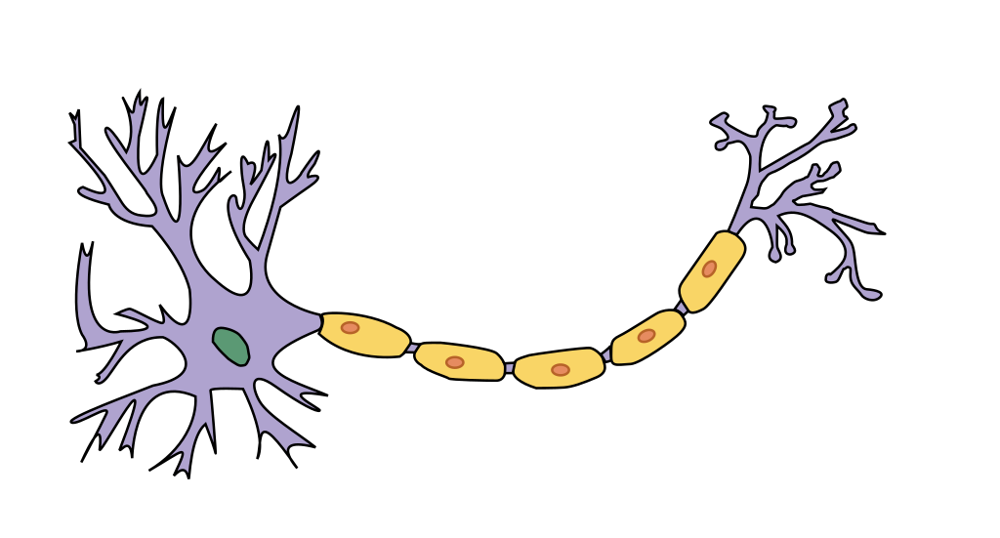

<!--- Draft options -->
\SetWatermarkScale{0.3}
\SetWatermarkText{\textbf{Draft: \today}}

<##define note|\textcolor{red}{NOTE: #1}>
<##define check|\textcolor{blue}{CHECK: #1}>
<##define todo|\textcolor{green}{TODO: #1}>

# Background {#sec:background}
## Biologically inspired computation
Biology has been a rich source of inspiration for techniques in computer
science. Many theories for processing in the brain have been implemented in
software aiming to understand how the brain works and to produce more
intelligent software capable of solving problems the brain tackles with ease.

During the late 30s and 40s much research on the foundations of computability
was being done. Turing invented his universal Turing machines; Alonzo Church
invented the lambda calculus; and, McCulloch and Pitts produced a simple
mathematical model of the biological neuron capable which too was shown to be
computationally universal.

Many types of neurons exist in the brain, but one is especially prevalent, it is
this type of neuron that inspired McCulloch and Pitts in their mathematical
model of the neuron.

## Artificial neural networks (ANNs) {#sec:background:ann}
Artificial neural networks are a class of machine learning algorithms initially
inspired by the brain. To understand neural networks, it is best to take each
concept from the bottom up step by step. First we shall examine *artificial
neurons*, of which there are several models, the earliest being the
McCulloch-Pitts neuron, followed by the now ubiquitous perceptron which serves
as the foundation of modern neural networks.

### The McCulloch-Pitt's neuron
The McCulloch-Pitt's neuron is mostly a historical curiosity, and if the
evolution of artificial neural networks doesn't interest you skip ahead to the perceptron.

Warren McCulloch and Warren Pitts were arguably the first to provide a
mathematical model of neuron inspired by biology, they developed a logical
calculus describing neuron behaviour[@mcculloch1943-logicalcalculusideas]. Their
model neuron, known as McCulloch-Pitt's neuron (MCP), was shown to be
computationally universal. Every network of MCP neurons encoded an equivalent
logical proposition.

MCP neurons have a set of inputs, the sum of which is compared to a threshold
which determines whether the neuron fires or not. Both excitatory and inhibitory
signals were modelled, if an incoming inhibitory connection is firing, then the
output is completely inhibited regardless of the firing of the other incoming signals.

Networks of MCP neurons were investigated to implement more complicated
propositions.

### The Perceptron
The next major contribution to the realisation of artificial neural networks
following McCulloch and Pitt's work was the
Perceptron[@rosenblatt1957-Perceptronperceivingrecognising], initially conceived
as a physical device for learning to recognise patterns in images or sounds
(each of these using the sample principles, but with different inputs) by Frank
Rosenblatt, it was later described in algorithmic form.

The modern perceptron is a supervised algorithm for learning a binary classifier
with a linear decision. There are two aspects to be considered, the form of
classifier, and the learning algorithm that decides on the instantiated parameters
the model will use. The classifier takes the form $\bm{w} \cdot \bm{x} > 0$,
where $\bm{w}$ is a learnt weight vector, and $\bm{x}$ is the feature
representation of the test instance. If the dot product of the weight vector with the
feature is greater than zero the test instance is labelled with the positive
class, otherwise it's labelled with the negative class.

The perceptron learning algorithm constructs a weight vector $\bm{w}$ from a set
of labelled training examples $\mathscr{X} = \{ (x_0, y_0), \dots, (x_n, y_n)
\}$ where $x_i$ is the feature representation of the $i$-th training example, and
$y_i$ is the true label of the example.

To train a perceptron we implement the following algorithm:

\begin{algorithm}[H]
\SetKwData{Converged}{converged}
\KwData{Training set: $\mathscr{X} = \{(\bm{x_0}, y_0), \cdots, (\bm{x_n}, y_n)\}$}
\KwResult{Binary classifier: $\bm{w} \cdot \bm{x} > 0$}
$\bm{w} \leftarrow \bm{0}$\;
\Converged $\leftarrow$ false\;
\While{\Converged = false}{
  \Converged $\leftarrow$ true\;
  \For{$i = 1$ to $|\mathscr{X}|$}{
    \If{$y_i \bm{w} \cdot \bm{x_i} \leq 0$}{
    $\bm{w} \leftarrow \bm{w} + \learningrate y_i \bm{x_i}$\;
    \Converged $\leftarrow$ false\;
    }
  }
}
\end{algorithm}

The idea is to iteratively build up a weight vector $\bm{w}$ that correctly
classifies all training data. Initially starting with the zero vector will
result in the misclassification of all training examples as they will all lie on
the decision boundary. The core of the algorithm depends on understanding the
dot product as a measure of similarity, by adding weighted training examples to
the weight vector we increase the similarity of the updated weight vector with the
training example resulting in a more positive dot product between $\bm{w}$ and
$\bm{x}$ which is more likely to pass the decision threshold.

The perceptron learns a linear classifier, which is only of use if the data is
linearly separable, if it isn't then we have to consider alternatives. One of
the nice properties of linear classifiers that make use of the dot product is
that they can be kernelised resulting in learning a non-linear decision
boundary, although this approach isn't fully generic, the choice of kernel must
be chosen to separate a specific data set.

We will examine the XOR function to see where the Perceptron (amongst other
linear classifiers) fails, and how we can learn a classifier for this function.

{#fig:xor}

Consider a linear decision boundary, is there any way to orient it such that the
red examples are separated from the white points in [@fig:xor]? Sadly there
isn't and the problem can only be solved with a non linear decision boundary.
Perceptrons can be used to learn a non linear decision boundary in one of two
ways, one replace the dot product with a kernel function, a function with
properties similar to that of the dot product, this can be thought of as a
transformation of the instances into a new space in which the data is linearly
separable and a linear decision boundary is learnt, alternatively we can stack
perceptrons so that the output of one is used as the input to another, this
technique is known as *multilayer perceptrons (MLP)*. When using MLPs we have to
adapt the perceptron's output to be followed by a non-linear transformation, the
reason for this is that if we otherwise stacked perceptrons we'd be learning
linear transformations of linear transformations which result in a linear
transformation, i.e. MLPs without non linearity are no more expressive than
a single perceptron, the complexity of the decision boundaries learnt by MLPs is
thanks to the successive application of linear transformations and non
linearities.

Combining multiple perceptrons into a network forming a multi layer perceptron
brings us closer to the modern artificial neural network, however the
combination of perceptrons presents a new problem: how do we learn the weight
vectors of all the perceptrons? The weight vectors are not independent, so
changing one will effect those deeper in the network. To solve the XOR problem
we can construct perceptrons that simulate Boolean functions and then use the
XOR propositional decomposition to construct a network that implements XOR. This
solution is unsatisfying due to its lack of generality, why bother going down
this route if we end up designing networks in terms of digital logic rather than
learning networks from training sets.

Training multilayer perceptrons was a problem until the process of error back
propagation (first developed by Kelley[@kelley1960-GradientTheoryOptimal] and
Bryson[@dreyfus1990-Artificialneuralnetworks][@schmidhuber2015-DeepLearningNeural])
was applied to the problem by Paul Werbos[@schmidhuber2015-DeepLearningNeural].
Back propagation gives us a tool to learn how modifying the weight vector of
each perceptron varies the output of the network, it achieves this by
calculating the partial derivatives of the output with respect to each weight
component. Having obtained the partial derivatives we can perform gradient
ascent to tweak the weights in such a way that the output of the network becomes
closer to the desired output for each training example.

Before moving on to a more concrete explanation of backprop it pays to consider
how to graphically represent a MLP as the understanding of the backprop is aided
considerably by diagrams. A perceptron receives a N-dimensional input vector
$\bm{x}$ and computes the dot product with the weight vector $\bm{w}$ followed
by the application of a non linearity $\phi$. We can instead interpret the input
of a perceptron as the weight sum of the inputs $\sum_i \bm{x_i} \bm{w_i}$, this
maps to a graphical representation of a set of edges denoting connectivity
of the input perceptron, an edge connecting a source to the perceptron labelled
with the corresponding component of the weight vector. We treat the components
of the input vector $\bm{x}$ implicitly by the

Conclude with the modern form of Artificial neural network.

{#fig:ann-example}

{#fig:ann-forward}

So far we have only considered ANNs without cycles, these are known as
*feed-forward neural networks*, however not all networks are of this form, many
architectures include cycles which endow networks with memory, any network with
cycles is known as a *recurrent neural network* (RNN), however these networks
are out of the scope of this thesis.

## Convolutional neural networks (CNNs) {#sec:background:cnns}

Convolutional neural networks (CNNs) are a constrained form of feed forward ANN
inspired by the visual cells in the brain which are receptive to small areas of
the visual input called receptive fields. A traditional ANN can have any sort of
connectivity between the adjacent layers of neurons. CNNs instead assume that
the inputs to the network are images allowing optimisation of the architecture
to increase the tractability of training at the cost of its representational power.

<##check Should be image, or just an arbitrary 2D signal?>

The number of parameters in an ANN scales based on the number of neurons and
number of layers, by constraining the types of functions the layer can compute we
can achieve a large reduction in the number of parameters increasing.

Instead of being homogeneous like a typical ANN, CNNs have a variety of layer
types, again, the main motivation of adding new layer types is the reduction
in computational complexity of training the network. We encode assumptions about
what we want CNNs to learn by their architecture.

The description of CNNs is quite different to ANNs.

The restricted architectures of CNNs facilitates a new view on these networks
compared to ANNs; one of the overarching themes is to raise the level of
abstraction from neurons to layers, and individual inputs to input volumes.
Traditional ANNs have no fixed function, different groups of neurons in a layer
can serve different purposes, however this is not the case in CNNs, layers are
homogeneous in their function, e.g. a convolutional layer only computes convolution
of its input. CNN architectures are described by their constituent layers and
the hyperparameters that configure those layers, different layer types have different
hyperparameters.

Layers are constructed using this conceptual model and can be mapped down to the
traditional ANN model of neurons and weights.

### Inputs and intermediate computations

Inputs to a CNN are considered as volumes rather than a set of disparate
features, this terminology emphasises the homogoneity of the input. An input
volume is a 3D block, where width, $W$, and height, $H$, correspond to the width
and height of the input image, and the depth, $D$, of the block corresponds to
the number of channels in the image (e.g. 3 for RGB images, 1 for grayscale).

When a volume is processed by a layer, an output volume is produced of
potentially different shape. Layers can be thought of volume transformation
functions.

CNNs typically start from a large but shallow frame which is progressively
processed to become deeper, and less wide and high.

### Layers

#### Fully connected
Fully connected layers are traditional neural network layers where each neuron
is connnected to every possible input neuron. These layers are very large in
parameters so are usually used further in the network when the input volume size
has been considerably reduced.

#### Pooling
Pooling layers reduce the size of their input volume by computing some function
over a region of the input producing a single value, usually this is a rectified
linear computation $\max(0, x)$ or something similar like logistic regression.

#### Convolutional
Convolutional layers consist of one or more filters that are slid along the
input volume and convolved at each location producing an output volume. The
filter parameters are learned, but constant across different locations in the
input volume, this massively reduces the number of parameters of the model
making them much more space efficient than fully connected networks.

The number of parameters in a convolutional layer is *only* dependent upon the
filters. The filter is parameterised by its size, stride and zero padding. The
size determines the volume of the filter; the stride, how the filter is moved
through the input volume; zero padding, whether or not the filter is padded with
zeros when convolved with a volume.

For a layer with 4 filters with the parameters:

* Size: $W_f \times H_f \times D_f$ = $4 \times 4 \times 3$
* Padding: $W_p \times H_p \times D_p$ = $0 \times 0 \times 0$
* Stride: $S_w \times S_h \times S_d$ = $1 \times 1 \times 0$

The layer has a total of $4 \cdot 4 \cdot 3 \cdot 1 \cdot 1 = 38$ parameters.

#### Rectification

Rectification in electrical engineering refers to the conversion of AC to DC.
Half wave rectification involves stopping the direction of current in one
direction so current pulses only in one direction.

The concept of half wave rectification is borrowed and used to construct a new
type of layer. Rectification layers prevent negative values flowing through the
layer by applying $\max$ to the input.

Logistic regression can be used to approximate ReLU, the main benefit being its
analytical derivative (CHECK).

### Object detection {#sec:background:object-detection}

CNNs have been extensively applied to the object detection problem popularised by
the ImageNet challenge [@russakovsky2014-ImageNetLargeScale]. The challenge consists of two main problems
*object detection* and *object localisation*, participants produce model
capable of predicting the likelihood of object classes presence in a test
image. Models are evaluated based on their top 5 predictions.

In 2011 the best top-5 classification error rate was 25%, however in 2012 an error
rate of 17% was achieved by use of deep convolutional networks [@krizhevsky2012-Imagenetclassificationdeep].
This large jump in efficacy spawned a large amount of research into DNNs, and
since has seen the error rate progressively drop each year with better and
better DNNs.

#### AlexNet

#### VGG16

### Two stream CNNs {#sec:background:two-stream}
Two stream networks for action recognition were first proposed
[@simonyan2014-TwoStreamConvolutionalNetworks]. There are a variety of
architectures, the simplest being two networks each separately trained, one for
spatial data (the raw frames from videos), one for temporal data (the optical
flow derived from video). The two networks are then *fused* together at the
final layer by some scoring function.

An extension of Simonyan \etal's two stream architecture was proposed by
Feichtenhofer \etal
[@feichtenhofer2016-ConvolutionalTwoStreamNetwork] which modifies the basic two
stream network to fuse results part way through the network as well as the last
two layers.

https://www.youtube.com/watch?v=a5wKkzMSjDM
## Understanding CNNs {#sec:background:understanding}

It is typical for CNNs to have on the order of $10^7$--$10^8$ parameters,
with this complexity comes a difficulty in understanding the

### Layer activation visualisation {#sec:background:feature-analysis:layer-activation-visualisation}
A common and simple method of gaining insight into the features learnt by a
network is to visualise the filter responses of each layer as the image
progresses through the network.

This technique is particularly informative in the lower layers as the filters
tend to be simple edge detectors etc.

### Weight visualisation {#sec:background:feature-analysis:weight-visualisation}

### Filter visualisation

### Saliency maps
#### Ablation {#sec:background:feature-analysis:image-ablation}

#### Deconvolution {#sec:background:feature-analysis:deconvolution}

#### Excitation back propagation {#sec:background:feature-analysis:excitation-backprop}

Excitation back propagation (EBP) is technique to generate *attention maps* at any
layer in a CNN. It is inspired by the back propagation algorithm used for
training.

The factors affecting attention can be categorised into two classes:

* *Bottom-up*: factors that are only dependent upon the input of the network,
  and *not* the state of the network.
* *Top-down*: factors related to the goal; in object localisation, a salient factor
  would be the object class being localised.

*Top-down* refers to movement from the output to the input of the network, whereas
*Bottom-up* refers to movement from the input to the output of the network.

First a forward pass of the network is computed, this produces the intermediate
neuron values which are used as *bottom up* salience factors, then a probability
distribution over the output layer is used to specify *top down* salience, then a
excitation backprop pass uses the probability distribution, intermediate neuron
values and weights to determine the probability of each intermediate neuron
being a winner at an arbitrary depth of the network.

Contrastive top down attention uses the insight that we're not only interested
in class we're localising, but also the absences of the other classes (as
classes may be correlated), we EBP the class of interest one layer, then invert
the output probability distribution, EBP one layer and compute the difference
between the two MWPs of the second last layer, then EBP from there to the input.

)

##### Example EBP calculation

We demonstrate EBP with a simple network composed of 5 neurons over 3 layers all
using ReLU activations.

Notation:

* $\neuron{i}{j}$ denotes the neuron with index $j$ (0 indexed) in layer $i$.
* $\weight{i}{j}{k}$ denotes the weight of the edge from neuron $j$ in layer $i$
  to neuron $k$ in layer $i + 1$.
* $\neuroninput{i}{j}$ denotes the weighted sum of inputs to neuron $j$ in layer $i$
* $\neuronoutput{i}{j}$ denotes the output of neuron $j$ in layer $i$

\begin{equation}
\label{eq:neuron-input}
\neuroninput{i + 1}{j} = \sum_{a_{k}^{(i)} \in \children{i + 1}{j}} \weight{i}{k}{j} \neuronoutput{i}{k}
\end{equation}

\begin{equation}
\label{eq:neuron-output}
\neuronoutput{i}{j} = \phi(\neuroninput{i}{j})
\end{equation}

Where $\phi$ is an activation, if not explicitly stated it is assumed $\phi(x) =
\max(0, x)$ (ReLU activation).

At a high level, EBP consists of the following steps:

* Compute a forward pass of the network to determine the outputs of each neuron $\neuronforward{i}{j}$
* Compute the scaling factors $\ebpscalar{i}{j}$ of each neuron used in
  calculating the conditional winning probabilities of the children of that neuron.
* Compute the conditional winning probabilities $\cwp{i}{j}{i + 1}{k}$ of each neuron in the network.
* Compute the winning probabilities of each neuron $\mwp{i}{j}$ by
  computing the probability of each neuron and it's parents being winning
  neurons, then marginalising over the parent neurons.

\begin{equation}
\label{eq:ebp-cwp}
\cwp{i}{k}{i + 1}{j} = \begin{cases}
    \ebpscalar{i + 1}{j} \neuronforward{i}{k} \weight{i}{k}{j} & \weight{i}{k}{j} \geq 0 \\
    0 & \text{otherwise}
  \end{cases}
\end{equation}

\begin{equation}
\label{eq:ebp-cwp-scalar}
\ebpscalar{i + 1}{j} = 1 / \sum_{k:\weight{i}{k}{j} \geq 0} \neuronforward{i}{k} \weight{i}{k}{j}
\end{equation}

\begin{equation}
\label{eq:ebp-mwp}
\mwp{i}{k} = \sum_{\neuron{i+1}{j} \in \parents{i}{k}} \cwp{i}{k}{i + 1}{j} \mwp{i + 1}{j}
\end{equation}

Performing excitation backprop on the example network in [@fig:ann-example]. The
forward pass is detailed in [@fig:ann-forward].

First we define the input of the network (these could be any arbitrary input):

\begin{align*}
\neuronforward{0}{0} &= 2\\
\neuronforward{0}{1} &= 1\\
\end{align*}

Now we compute the forward pass using the forward propagation rule

<##todo move this to ANN section>
$$\neuronforward{i}{k} = \phi(\sum_j \neuronforward{i - 1}{j} \cdot \weight{i - 1}{j}{k})$$

\begin{align*}
\neuronforward{1}{0} &= \max(0, \neuronforward{0}{0} \cdot \weight{0}{0}{0} +
    \neuronforward{0}{1} \cdot \weight{0}{1}{0})
  = max(0, (2 \cdot 1) + (1 \cdot 0)) = 2 \\
\neuronforward{1}{1} &= \max(0, (2 \cdot -1) + (1 \cdot 1)) = \max(0, -1) = 0\\
\neuronforward{1}{2} &= \max(0, (2 \cdot 1) + (1 \cdot 1)) = 3\\
\\
\neuronforward{2}{0} &= \max(0, \neuronforward{1}{0} \cdot \weight{1}{0}{0} +
    \neuronforward{1}{1} \cdot \weight{1}{1}{0} +
    \neuronforward{1}{2} \cdot \weight{1}{2}{0}) = 4 \\
\neuronforward{2}{1} &= \max(0, (2 \cdot 1) + (0 \cdot 2) + (3 \cdot -1)) = 0\\
\end{align*}

The next step is to compute the conditional winning probabilities of each neuron
given each parent neuron wins using [@eq:ebp-cwp], to compute this we need the
scaling factors $\ebpscalar{i}{j}$ which we will compute first using
[@eq:ebp-cwp-scalar] (in a computational implementation these would be computed
on a per layer basis and thrown away once the layer values have been
calculated).

<## todo change legend to have $P(a_k^{(i)})$ in diamond>

\begin{align*}
\ebpscalar{2}{0} &=
  \frac{1}{\left(\weight{1}{1}{0}\neuronforward{1}{1}\right) +
  \left(\weight{1}{2}{0} \neuronforward{1}{2}\right)}
  = \frac{1}{(1 \cdot 0) + (2 \cdot 3)}
  = \frac{1}{6}
  \\
\ebpscalar{2}{1} &= \frac{1}{(1\cdot 2) + (2 \cdot 0)} = \frac{1}{2}\\
\ebpscalar{1}{0} &= \frac{1}{
  \left(\weight{0}{0}{0} \neuronforward{0}{0}\right) +
  \left(\weight{0}{1}{0} \neuronforward{0}{0}\right)}
  = \frac{1}{(1 \cdot 2) + (0 \cdot 1)}
  = \frac{1}{2}
  \\
\ebpscalar{1}{1} &= \frac{1}{(1 \cdot 1)} = 1\\
\ebpscalar{1}{2} &= \frac{1}{(1 \cdot 2) + (1 \cdot 1)} = \frac{1}{3}\\
\end{align*}

Now for the conditional winning probabilities between layers 2 and 1:

\begin{align*}
\cwp{1}{0}{2}{0} &= 0 \\
\cwp{1}{0}{2}{1} &= \ebpscalar{2}{1} \neuronforward{1}{0} \weight{1}{0}{1} =
  \frac{1}{2} \cdot 2 \cdot 1 = 1
  \\
\cwp{1}{1}{2}{0} &= \ebpscalar{2}{0} \neuronforward{1}{1} \weight{1}{1}{0} =
  \frac{1}{6} \cdot 0 \cdot 1 = 0
  \\
\cwp{1}{1}{2}{1} &= \ebpscalar{2}{1} \neuronforward{1}{1} \weight{1}{1}{1} =
  \frac{1}{2} \cdot 0 \cdot 2 = 0
  \\
\cwp{1}{2}{2}{0} &= \ebpscalar{2}{0} \neuronforward{1}{2} \weight{1}{2}{0} =
  \frac{1}{6} \cdot 3 \cdot 2 = 1
  \\
\cwp{1}{2}{2}{1} &= 0\\
\end{align*}

Now layers 1 and 0:

\begin{align*}
\cwp{0}{0}{1}{0} &= \ebpscalar{1}{0} \neuronforward{0}{0} \weight{0}{0}{0} =
  \frac{1}{2} \cdot 2 \cdot 1 = 1\\
\cwp{0}{0}{1}{1} &= 0 \\
\cwp{0}{0}{1}{2} &= \frac{1}{3} \cdot 2 \cdot 1 = \frac{2}{3} \\
\cwp{0}{1}{1}{0} &= 0 \\
\cwp{0}{1}{1}{1} &= 1 \cdot 1 \cdot 1 = 1 \\
\cwp{0}{1}{1}{2} &= \frac{1}{3} \cdot 1 \cdot 1 = \frac{1}{3} \\
\end{align*}

We can now marginalise over the parent neurons in the conditional winning
probabilities if a prior distribution over the output neurons is given to obtain
the marginal winning probabilities of each neuron using [@eq:ebp-mwp].

Let's choose $\mwp{2}{0} = 0.9$ and $\mwp{2}{1} = 0.1$ for the prior
distribution. If we were investigating the saliency of a single neuron we'd
instead set the MWP of that neuron to 1 and the MWP of all other neurons
would be 0.

Marginalising over the parents of the hidden layer:

\begin{align*}
\mwp{1}{0} &= \sum_{\neuron{2}{j} \in \parents{1}{0}} \cwp{1}{0}{2}{j} \mwp{2}{j} \\
           &= \cwp{1}{0}{2}{0} \mwp{2}{0} + \cwp{1}{0}{2}{1} \mwp{2}{1} \\
           &= 0 \cdot 0.9 + 1 \cdot 0.1 = 0.1\\
\mwp{1}{1} &= 0 \cdot 0.9 + 0 \cdot 0.1 = 0\\
\mwp{1}{2} &= 1 \cdot 0.9 + 0 \cdot 0.1 = 0.9\\
\end{align*}

Finally to calculate the MWP of the input neurons to obtain the posterior
distribution:

\begin{align*}
\mwp{0}{0} &= 1 \cdot 0.1 + 0 \cdot 0 + \frac{2}{3} \cdot 0.9 = 0.7\\
\mwp{0}{1} &= 0 \cdot 0.1 + 1 \cdot 0 + \frac{1}{3} \cdot 0.9 = 0.3\\
\end{align*}

### Gradient ascent in image space {#sec:background:feature-analysis:backprop}

Backpropagation can be used to determine an image that maximally excites a
neuron by performing gradient ascent on the derivative of a neuron with respect
to the input pixels.

### CNN code inversion
#### Deep generative networks {#sec:background:feature-analysis:deep-generative-networks}

#### Adversarial input stimuli analysis {#sec:background:feature-analysis:adversarial-stimuli}

# Appendix

# Glossary

ANN

: Artificial Neural Network

CNN

: Convolutional Neural Network

DNN

: Deep artificial neural network (one with multiple hidden layers)

Attention

:

Top down attention

: Attention driven by top down factors like task information

Bottom up attention

: Attention based soley on the salience of regions of the input image.

Attention Map

: See Saliency map

Salience (of an object)

: How much does an object stand out relative to neighbouring objects.

Saliency Map

: A heatmap over an image denoting salience.

# References
